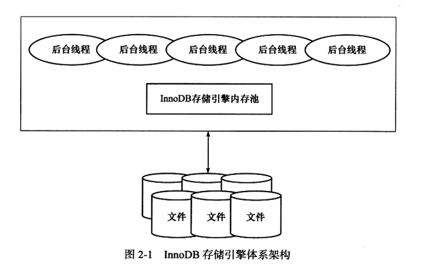
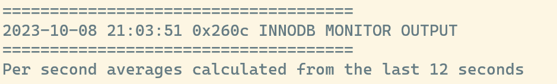
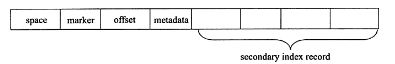
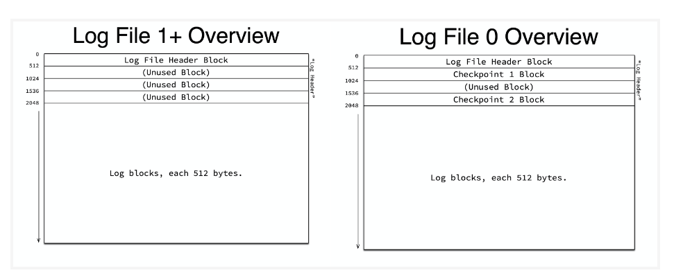
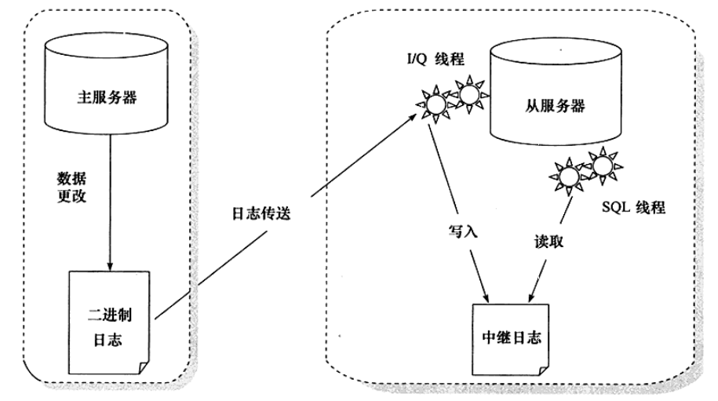

# MySQL体系结构和存储引擎

# InnoDB存储引擎
## InnoDB体系架构
简单的架构如下图所示



内存池主要负责维护所有进程/线程需要访问的内部数据结构，对磁盘上的进行缓存，重做日志缓存等。

后台线程负责刷新内存池中的数据，将已修改的数据文件刷新到磁盘文件，在发生异常时能恢复正常运行。

### 后台线程
后台线程有以下几种
- Master Thread：主要负责将缓冲池中的数据异步刷新到磁盘，保证数据的一致性，包括脏页的刷新、合并插入缓冲、UNDO也的回收。
- IO Thread：负责异步IO请求的回调处理。
- Purge Thread：事务提交后，对于的undolog不再需要。PurgeThread负责回收undo页。
- Page Cleaner Thread：用于将脏页刷新到磁盘。

### 内存
#### 缓冲池
缓冲池中包含了索引页、数据页、undo页、插入缓冲、自适应哈希索引、InnoDB存储的锁信息、数据字典信息等。

InnoDB允许多个缓冲池实例，每个页根据[哈希值](## "哈希值怎么计算？根据物理地址吗？")平均分配到不同缓冲池实例中。可以减少内部资源竞争，增加数据库的并发处理能力。

缓冲池通过LRU变种算法进行管理，它有以下特征
- 将列表分为两部分，前面的5/8是新列表，后面的3/8是旧列表，新列表尾部和旧列表头部的交界处称为重点。
- 新读取的页面添加到中点（旧列表的头部）
- 当访问旧列表中的页面时，会将它加到子列表的头部。

使用这种改进算法的原因是，当执行表扫描的时候会将大量页面带入缓冲池，提前读也会将一些页面带入缓冲区，这些页面进入缓冲区的时候会驱逐相同数量的页面，但是这些页面将不会再被使用，从而将降低了性能。

通过参数innodb_old_blocks_time可以配置当页被放置到中点后等待多久才会被加入到LRU列表的新列表。

page made young操作：页面从LRU列表的旧列表加入到新列表的操作。
page not made young操作：当因innodb_old_blocks_time设置而没有将页面从旧列表到新列表的操作。

通过命令``SHOW ENGINE INNODB STATUS``的BUFFER POOL AND MEMROY部分可以查看缓冲池的运行指标，如下图所示


通常情况下缓冲区命中率应该超过95%，否则说明存在LRU列表被污染的问题。

``SHOW ENGINE INNODB STATUS``命令显示的过去某个时间范围内的状态，具体信息INNODB_MONITOR_OUTPUT部分开头显示。


INNODB支持压缩页，即将16KB的页压缩为1KB、2KB、4KB和8KB。对于非16KB的页，通过unzip_LRU列表管理。

unzip_LRU列表对不同的大小的页进行分别管理，通过[伙伴算法](## "TODO")进行内存的分配。

当LRU中的页被修改后，不会立即写回磁盘，而是通过检查点机制将脏页刷新会磁盘。使用Flush列表对脏页进行管理，脏页同时存在于LRU列表和Flush列表。``SHOW ENGINE INNODB STATUS``中的Modified db pages显示了脏页的数量。

[NEW]: # (ChangeBuffer, AdaptiveHashIndex,LogBuffer)

[OLD]: # (BEGIN)
#### 重做日志缓冲
INNODB将重做日志信息放入这个缓冲区，然后按一定的频率刷新到重做日志文件。默认大小为8MB，可以使用innodb_log_buffer_size控制。

重做日志刷新的情况
- Master Thread每秒将重做日志缓冲刷新到重做日志文件。
- 每个事务提交时会将重做日志缓冲刷新到重做日志文件。
- 当重做日志缓冲池剩余空间小于一半时，将其刷新到重做日志文件。

#### 额外的内存池
当对一些数据结构本身的内存进行分配时，需要从额外的内存池中进行申请，当该区域内存不够时，会从缓冲区中申请。
每个缓冲池的帧缓冲、缓冲控制对象（包含了LRU、锁、等待等信息）需要从额外内存池中申请，在提高缓冲池大小时，也应该相应提高额外的内存池大小。

[OLD]: # (END)

## 检查点技术
检查点技术解决以下几个问题
- 缩短数据库的恢复时间。
- 当缓冲池不够用时，将脏页刷新到磁盘。
- 当重做日志不可用时，刷新脏页。

InnoDB引擎通过LSN来标记版本，LSN是一个不断增长的8字节的数字。每个重做日志与一个开始LSN和结束LSN关联。当执行检查点时，InnoDB会在包含检查点LSN的文件的头部存储检查点的LSN。

每个页有LSN，重做日志中有LSN，Checkpoint有LSN。

重做日志是循环使用的

InnoDB存储引擎有两种检查点
- Sharp检查点：在数据库关闭时将所有脏页刷新会磁盘。
- Fuzzy检查点：只刷新一部分脏页。

Fuzzy检查点有以下几种
- Master Thread检查点：每秒或每十秒的速度从缓冲池中的脏页列表中刷新一定比例的页面会磁盘。异步刷新，不会阻塞用户查询。
- FLUSH_LRU_LIST检查点：当LRU中的页面被驱逐时执行。
- Async/Sync Flush检查点：当重做日志文件不可用时，强制将一些页刷新回磁盘。脏页从脏页列表中选取。

    定义已写入重做日志的LSN和刷新会磁盘的LSN之间的差值为checkpoint_age。
    定义async_water_mark为重做日志文件总大小的75%，sync_water_mark为重做日志文件总大小的90%。
    那么，刷新规则为
    
    - 当checkpoint_age $<$ async_water_mark时，不需要刷新脏页
    - 当async_water_mark $<$ checkpoing_age $<$ sync_water_mark时，触发Aysnc Flush，从Flush列表中刷新足够的脏页使得checkpoint_age $<$ async_water_mark。
    - 当checkpoint_age $>$ sync_water_mark时，触发SyncFlush，从Flush列表中刷新足够的脏页使得checkpoint_age $<$ async_water_mark。一般很少发生，除非重做日志文件很小且进行阻塞插入操作。
- Dirty Page too much检查点：当脏页的数量过多时，会强制进行检查点。使用参数innodb_max_dirty_pages_pct（默认75）控制，表示缓冲池中脏页比例超过该参数的值时，强制执行检查点。

## Master Thread工作方式
Master Thread具有最高的线程优先级别，内部由多个循环组成，会根据数据库的运行状态在循环之间进行切换，多个循环分别如下所示
- 主循环：大多数操作在这个循环中进行，其中有两个主要的操作：每秒钟的操作和每十秒的操作。

    每秒一次的操作包括
    - 日志缓冲刷新的磁盘，即使事务没有提交（必定）：可让较大事务提交时间也很短。
    - 合并插入缓冲（可能）：判断前一秒内发生的IO次数是否小于innodb_io_capacity值的5%，如果是，则认为IO压力小，可以执行合并插入缓冲操作，合并的数量为innodb_io_capacity值的5%。
    - 至多刷新innodb_io_capacity个缓冲池中的脏页到磁盘（可能）：判断当前缓冲池中脏页的比例（buf_get_modified_ratio_pct）是否超过了innodb_max_dirty_pages_pct。如果启用了自适应刷新，在不超过阈值时，会根据产生重做日志的速度来刷新一定数量的脏页。
    - 如果当前没有用户活动，则切换到后台循环（可能）。

    每十秒的操作包括：
    - 刷新innodb_io_capacity个脏页到磁盘（可能）：过去10秒内磁盘IO操作是否小于innodb_io_capacity次。
    - 合并至多innodb_io_capacity值的5%个插入缓冲（必定）
    - 将日志缓冲刷新到磁盘（必定）
    - 删除无用的Undo页（必定）：删除MVCC中不需要的行，即结束事务id小于当前最小事务id的数据。最多尝试回收innodb_purge_batch_size（默认20）个undo页。
    - 刷新100个或者10个脏页到磁盘（必定）：缓冲池中脏页的比例（buf_get_modified_ratio_pct）超过70%，刷新innodb_io_capacity个脏页；否则刷新innodb_io_capacity值的10%的脏页。


- 后台循环：若数据库空闲或数据库关闭时，会切换到后台循环，执行以下操作
    - 删除无用的undo页（必定）
    - 合并innodb_io_capacity个插入缓冲（必定）
    - 跳回主循环或刷新循环：当空闲时，跳转到刷新循环，否则跳转到主循环。

- 刷新循环：在刷新循环中，每次刷新innodb_io_capacity个脏页到磁盘中，直到缓冲区中的脏页比例小于innodb_max_dirty_pages_pct变量值。如果没有其他事情可做，就会跳转到暂停循环中。

- 暂停循环：在暂停循环中，会将Master Thread线程挂起，等待事件的发生。事件发生后跳转到主循环中。


综上所述，Master Thread的伪代码为
``` c
void master_thread() {
    goto loop;
    loop:
    for (int i = 0; i < 10; i++) {
        thread_sleep(1);
        do log buffer flush to disk;
        if (last_one_second_ios < 5% innodb_io_capacity) {
            do merge at most 5% innodb_io_capacity insert buffer;
        }
        if (buf_get_modified_ratio_pct > innodb_max_dirty_pages_pct) {
            do buffer pool flush innodb_io_capacity dirty page;
        } else if (enable adaptive flush) {
            do buffer pool flush desired amount dirty page
        }
        if (no user activity) {
            goto background loop;
        }
    }
    if (last_ten_second_ios < innodb_io_capacity) {
        do buffer pool flush innodb_io_capacity dirty page;
    }
    do merge at most 5% innodb_io_capacity insert buffer;
    do log buffer flush to disk;
    do full purge;
    if (buf_get_modified-ratio_pct > 70%) {
        do buffer pool flush innodb_io_capacity dirty page;
    } else {
        buffer pool flush 10% innodb_io_capacity dirty page;
    }
    goto loop;
    background loop:
    do full purge;
    do merge innodb_io_capacity insert buffer;
    if not idle:
        goto loop;
    else
        goto flush loop;
    flush loop:
    do buffer pool flush innodb_io_capacity dirty page;
    if (buf_get_modified_ratio_pct > innodb_max_dirty_pages_pct) {
        goto flush loop;
    }
    goto suspend loop;
    suspend loop:
    suspend_thread();
    waiting event;
    goto loop;
}
```

主循环中的间隔是通过sleep来实现的，意味着这个间隔是不准确的，在负载比较大的情况下可能会有延迟。

## InnoDB关键特性
关键特性有
- 变更缓冲
- 双写
- 自适应哈希索引
- 异步IO
- 刷新邻接页

### 变更缓冲
是一个特殊的数据结构，用于解决非唯一的聚集索引发生并更时产生的离散读取的问题。

在进行插入的时候，主键通常是递增的，插入顺序大致上也是递增插入的，因此，在插入聚集索引的时候，[一般是顺序的，不需要磁盘的随机读取](## "即在B+树的最后一个叶子节点进行插入，不需要通过访问B+树来找到插入的位置")。

而对于非唯一次级索引，由于插入不是顺序的，此时[需要离散的访问次级索引页](## "通过B+树查找插入位置")，从而导致插入性能下降。同理更新和删除也存在同样的问题

使用变更缓冲后，可以在进行非聚集索引的插入或更新时，先判断插入的非聚集索引页是否在缓冲池中，若在，直接插入；否则，先放到一个变更缓冲中。

变更缓冲与索引页的合并通常有两种方式
- 当其他读操作将受影响的索引页读取到缓冲池时进行合并。
- 以一定的频率将变更缓冲和次级索引叶子节点进行合并。

使用变更缓冲需要同时满足以下两个条件
- 索引是辅助索引
- 索引不是唯一的：不需要查找索引页来判断记录的唯一性。

当在进行大量修改时，如果在变更缓冲还没有合并到索引页前，数据库宕机了，那么此时恢复可能需要很长时间。

变更缓冲在内存中是缓冲池的一部分，在硬盘上是系统表空间中一部分，以一个B+树的方式存储，键值由space，marker和offset组成，其中space表示插入记录所在的表空间id，占用4字节；marker用于兼容旧版本的插入缓冲，占用一个字节；offset表示页所在的偏移量，占用四4字节。
当插入次级索引时，如果也不在缓冲池中，根据上述规则构造一个键，然后将记录插入到B+树中。叶子节点中记录的结构如下图所示，


其中metadata占用四个字节，存储了三个字节：IBUF_REC_OFFEST_COUNT占用两个字节，表示记录进入变更缓冲的顺序，通过这个顺序进行回放；IBUF_REC_OFFSET_TYPE占用一个字节；IBUF_REC_OFFSET_FLAGS占用一个字节。

变更缓冲的合并操作发生在以下几种情况
- 次级索引被读取到缓冲池，
- 当次级索引页无可用空间时
- 在Master Thread中进行

### 双写
双写主要是为了提高数据的可靠性。双写分为两个部分，一部分是内存中的双写缓冲区，另一个部分是系统表空间中的连续物理页。在将页面写入物理磁盘时，首先将页面写入到内存中的双写缓冲区，然后将双写缓冲区的内存写入到双写物理页，并立即刷新，由于这些物理页面是连续的，是顺序写入，开销较小。当写入物理页后，才将双写缓冲区中的页面写入到对应的磁盘位置，此时的写操作是离散的。

当在写页面的时候数据库宕机，在重启时可以从双写物理页进行数据恢复。当在写双写物理页时失效，则从其他方式进行恢复。

如果文件系统提供了类似的功能，则可以使用参数skip_innodb_doublewrite禁止双写功能。

### 自适应哈希索引
InnoDB存储引擎会监控表上各索引页的查询。如果发现哈希索引可以提升效率，那么会建立自动哈希索引，因此称为自适应哈希索引。

自适应哈希索引通过缓冲池的B+树来构造，建立速度快，且不需要对整张表进行操作。

自适应哈希索引建立的条件为
- 对索引页的连续访问模式是一样的，且是相等比较
- 以此模式访问了100次。
- 该页通过该模式访问了N次，其中N为1/16的页记录。

可以通过参数innodb_adaptive_hash_index来控制是否启用，默认开启。

### 异步IO
异步IO的一个优势是可以进行IO合并，如果读取的页是连续的，那么可以合并为一个IO进行读取。

参数innodb_use_native_aio来控制是否启用Native AIO。

提前读、磁盘的写入是由AIO完成的。

### 刷新邻接页
刷新邻接页的原理是：当刷新一个脏页时，InnoDB会检测该页所在的extent的所有页，如果是脏页则会一起进行刷新。

可以通过innodb_flush_neighbors来控制是否启用，启用时需要考虑以下两个问题
- 是否可能将不怎么脏的页进行了写入后又变成了脏页
- 固态硬盘的性能是否需要启用
综上，对于机械硬盘建议启用，对于高性能磁盘，建议关闭。

## 启动、关闭与恢复
InnoDB关闭时的行为，可以使用参数innodb_fast_shutdown进行控制，可取的值为
- 0：关闭时，需要删除所有的undo页，合并所有的变更缓冲，将所有脏页刷新回磁盘。这些操作可能需要很长的时间。在进行InnoDB升级时，必须使用这个参数关闭数据库
- 1：默认值，不需要删除所有的undo页和合并所有变更缓冲，但是会将一些脏页会刷新回磁盘。
- 2：不删除undo页，不合并变更缓冲，不刷新脏页，但会将日志写入日志文件保证不会又事务丢失，但在启动数据库时会进行恢复操作。

在启动时，如果上次是正常关闭，那么会正常启动。如果以外关闭或innodb_fast_shutdown设置为2后关闭，那么启动时会进行恢复操作。恢复的行为由参数innodb_force_recovery决定
- 0：默认值，当需要恢复时，进行所有的恢复操作；当不能进行有效恢复时，则可能无法正常启动，并将写入错误日志。
- 1（SRV_FORCE_IGNORE_CORRUPT）：恢复时，会忽略损坏的页
- 2（SRV_FORCE_NO_BACKGROUND）：阻止Master Thread线程的运行。
- 3（SRV_FORCE_NO_TRX_UNDO）：不进行事务的回滚操作。
- 4（SRV_FORCE_NO_IBUF_MERGE）：不进行变更缓冲的合并操作。
- 5（SRV_FORCE_NO_UNDO_LOG_SCAN）：不查看撤销日志，所有未提交的事务将视为已提交。
- 6（SRV_FORCE_NO_LOG_REDO）：不进行前滚操作。

当参数不会零时，无法进行DML操作。

# 文件
MySQL和InnoDB主要有以下几种类型的文件
- 参数文件：指定数据库文件的路径，指定初始化参数。
- 日志文件：记录MySQL的某种条件做出响应时写入的文件，如错误日志文件，二进制日志文件，慢查询日志文件，查询日志文件等。
- socket文件：使用Unix套接字方式进行连接时需要的文件
- pid文件：MySQL进程ID文件。
- MySQL表结构文件：用来存放MySQL表结构定义的文件。
- 存储引擎文件：

## 参数文件
MySQL在启动时如果找不到参数文件，会使用编译时指定的默认值和源码中参数的默认值启动实例，但如果在默认的目录下找不到mysql.host，则会启动失败。

可以通过``SHOW VARIABLES``查看数据库中的所有参数，可以使用LIKE进行过滤，也可以通过INFORMATION_SCHEMA下的GLOBAL_VARIABLES视图查找参数。

MySQL中的参数可以分类两类
- 动态参数：可以在实例运行的过程中进行修改。
- 静态参数：在实例的声明周期内不能修改。

动态参数可以通过SET进行修改。一些参数只能在当前会话中修改，一些参数会在整个实例中修改，一些参数可以选择生效范围是当前会话还是整个实例。

## 日志文件
### 错误日志文件
对MySQL启动、运行、关闭过程进行了记录，在遇到问题时应该首先查看该文件。该文件还记录了一些警告信息或正确的信息。

可以使用``SHOW VARIABLES LIKE 'log_err'``来定位错误日志文件。

### 慢查询日志
可以用于定位可能存在问题的SQL语句，从而进行SQL语句层面的优化。

通过参数long_query_time设置阈值，默认是10秒，运行时间超过这个阈值（不包含等于）的SQL语句会记录到慢查询中。

参数log_slow_queries用于控制是否开启慢查询日志，默认是不开启的。

通过将参数log_output指定为TABLE，慢查询也可以通过mysql.slow_log表进行查看。

### 查询日志
记录了所有对MySQL数据库的请求信息，无论这些请求是否得到了正确的执行。

参数general_log用于是否开启查询日志，默认不开启。

通过将参数log_output指定为TABLE，查询日志也可以通过mysql.general_log仅限查看。

### 二进制日志
记录了对MySQL执行更改的所有操作，如果操作本身没有导致数据库发生变化，该操作也会写入二进制日志。

二进制日志主要有以下几种作用
- 恢复：通过二进制日志进行point-in-time的恢复。
- 复制：使从库和主库进行实时同步。
- 审计：可以通过二进制日志中的信息来进行审计，判断是否有对数据库进行注入的攻击。

二进制日志所在目录有datadir指定，可以通过配置参数log-bin指定日志文件的名称。若不指定，则默认为主机名。设指定了名字为bin_log，则目录下有两种，一种使bin_log.00001，是二进制日志文件，后缀是日志序号，另一种是bin_log.index，是二进制的索引文件，用来存储过往产生的二进制日志序号。

二进制日志默认不启动，开启后性能下降约为1%。

一些关键的参数有
- max_binlog_size：指定了单个二进制日志文件的最大值，超过则产生新的日志文件，后缀加一，并记录到index文件。
- binlog_cache_size：二进制日志缓冲区大小，默认为32K。当数据库使用事务时，所有未提交的二进制日志会记录到缓存中，事务提交时直接将缓冲中的二进制日志写入二进制日志文件。这个参数是基于会话的，即每当有一个会话连接，MySQL会分配一个缓存。当缓冲区满时，会写入一个临时文件。
- sync_binlog：指定二进制日志同步到磁盘的方式
    - 0：MySQL依靠操作系统将二进制日志刷新到磁盘。
    - 1：表示将二进制日志同步写的磁盘。
    - N：大于1的值，表示每写N次缓冲区，就进行一次磁盘同步。
- binlog-do-db：表示要写入哪些库的日志。
- binlog-ignore-db：表示要忽略哪些库的日志。
- binlog_format：表示二进制日志的格式。将被废弃，二进制日志格式将是基于行的。

## 套接字文件
套接字文件有参数socket控制。一般是/tmp/mysql.sock。

## pid文件
MySQL启动时将自己的进程ID写入pid文件，由参数pid_file控制，默认位于数据库目录下，文件名为主机名，后缀为pid。

## 表结构定义文件
MySQL的每个表都会有一个后缀为frm的文件，这个文件记录了该表的表结构定义。视图也会有一个对应的frm文件。该文件是文本文件，可以直接查看。

## InnoDB引擎文件
### 表空间文件
#### 系统表空间
系统表空间是变更缓冲区的存储区域。当表在系统表空间创建时，系统表空间还会包含对应的表和索引数据。

系统表空间有一个或多个数据文件，默认情况下，系统表空间的文件名为ibdata1，初始大小为10MB。系统表空间文件的大小和数量由innodb_data_file_path定义。

innodb_data_file_path可以配置多个文件，并且指定每个文件的大小。如果在指定了autoextend，那么当用完指定的大小后，文件可以自动增长，每次扩展的大小由innodb_autoextend_increment参数决定。autoextend仅能在innodb_data_file_path中最后一个文件中指定。无法通过指定innodb_data_file_path中的文件大小来扩展系统表空间，启动时会产生错误。

#### file-per-table表空间
默认情况下，InnoDB会为每个表创建一个单独的表空间，表空间中包含了表的数据和索引，以单独的文件存放，默认文件名是表名.ibd。文件位于MySQL数据目录下的数据库文件中，可以在建表语句中使用DATA DIRECTORY子句指定表空间文件的存储目录。

相较于系统表空间，file-per-table表空间有以下优点

- 在截断和丢弃表时，磁盘空间会返回给操作系统。因此，这部分空间可以被操作系统使用
- 截断的性能更好
- 数据文件可以创建在不同的存储设备上，用于IO优化，空间管理或备份。
- 可以从另一个MySQL实例导入表
- 支持DYNAMIC和COMPRESSED行格式
- 当数据损坏、备份或二进制不可用或无法重启MySQL实例时，可以节省时间并提高成功恢复的几率
- 可以在不干扰其他表的情况下快速备份和恢复。
- 可以通过文件大小监控表在文件系统的大小。
- Linux文件系统不允许向单个文件并发写。
- 每个表的大小上限是64T。而共享表空间中表大小受限于表空间的上限。

相较于共享表空间，file-per-table表空间有以下缺点
- 每个表都存在未使用的空间。
- fsync操作将会执行多次。
- 必须保留一个打开的文件句柄，如果存在大量表，可能会影响性能。
- 当丢弃表时，需要扫描缓冲池，扫描操作会使用内部锁，可能会推迟其他操作。
- 每个文件会自动扩展，每次扩展4MB。

#### 通用表空间
通用表空间是使用CREATE TABLESPACE语法创建的表空间。

通用表空间提供了以下能力
- 是共享表空间，能够存储多个表
- 服务端在整个表空间的生命周期在内存中保留表空间元数据。相较于file-per-table有内存优势，在该表空间中的多个表只需要存储一个表空间元数据。
- 数据文件可以放在任意目录。
- 支持所有行格式和相关的特征。

通用表空间的限制有
- 生成的或现有的表空间不能更改为通用表空间
- 不支持创建临时通用表空间
- 通用表空间不支持临时表
- 截断或丢弃表的空间不能被操作系统回收。
- 通用表空间的表不支持ALTER TABLE DISCARD TABLESPACE和ALTER TABLE IMPORT TABLESPACE。
- 不支持放置表分区。
- 当源和副本在同一主机上的复制环境中，不支持ADD DATAFILE子句，因为会导致源和副本在同一位置创建同名表空间。
- 通用表空间不能再undo表空间目录中创建，除非InnoDB知道该目录。

#### undo表空间
undo表空间包含undo日志，undo日志中包含如何撤销事务对聚类索引记录的最近的更改。

当MySQL实例初始化时，会创建两个默认的undo表空间，undo表空间为回滚段提供了位置，在接收SQL语句前回滚段必须存在。

undo表空间创建的位置有innodb_undo_directory变量定义，如果未定义，则创建在数据目录。数据文件的名称为undo_001和undo_002。

undo表空间的初始大小是16MB。每次至少扩展16MB，如果上次扩展在0.1秒内，则此次扩展翻倍，最大为256MB。

可以使用CREATE UNDO TABLESPACE语法创建额外的undo表空间，undo表空间文件的扩展名必须为.ibu。

使用CREATE UNDO TABLESPACE创建的undo表空间，可以在运行时使用DROP UNDO TABLESPACE语法删除，undo表空间删除前必须为空。

清空undo表空间的步骤为
1. 使用ALTER UNDO TABLESPACE语法将undo表空间设置为不激活。
2. 当使用该表空间的事务完成后，purge会释放undo表空间中的回滚段，并将表空间截断到初始大小。

使用以下语句可以监控undo表空间的状态，当状态为inactive时表示新事务不使用该表空间，当状态为empty时，表示表空间已经被清空，可以删除。
```sql
SELECT NAME, STATE FROM INFORMATION_SCHEMA.INNODB_TABLESPACES WHERE NAME LIKE 'tablespace_name';
```

系统默认的undo表空间不可以被删除，但是可以将状态设置为inactive。在设置inactive前，必须有一个替代的undo表空间，因为至少需要两个undo表空间才能支持undo表空间的自动截断，这样可以确保一个undo表空间保持活动，另一个表空间离线截断。

undo表空间的自动截断有参数innodb_undo_log_truncate变量控制，当启用时，超过innodb_max_undo_log_size变量定义的大小的undo表空间将被截断。自动截断的过程如下
1. 当undo表空间超过指定大小时将被标记为截断。循环在标记的表空间中选择需要截断的undo表空间，避免总是截断相同的表空间。
2. 选中表空间的回滚段将不会处理新的事务。使用这个混滚段的事务可以继续使用。
3. 当回滚段不继续使用时，purge会释放相应的空间。
4. 释放空间后，截断undo表空间到初始大小。
5. 重新激活回滚段，接收新的事务。

手工进行截断时，需要至少三个undo表空间，因为自动截断需要两个。

当截断undo表空间时，该表空间的回滚段无法使用，因此，其他表空间的回滚段将负责系统所有的负载，因此，可能会导致性能下降，下降程度依赖于以下几个因素
- undo表空间的数量
- undo日志的数量
- undo表空间的大小
- 系统的IO
- 现有的长事务
- 系统负载

#### 临时表空间
临时表空间分为
- 会话临时表空间

    会话临时表空间存储用户创建的临时表和内部临时表。

    在首次请求创建磁盘临时表示从临时表空间池中分配给会话，一个会话最多分配两个，一个用于用户创建的临时表，另一个用于优化器创建的内部临时表。文件创建时的大小为五页，扩展名为ibt。当会话断开时，临时表空间会截断并放回池中。

    服务端启动时会创建一个包含10个临时表空间的池，池的大小不会缩小，必要时会向池中增加表空间。

    在基于语句的复制（SBR）模式下，副本上创建的临时表位于单个会话临时表空间中，只有在 MySQL服务器关闭时才会被截断。

- 全局临时表空间。

    全局临时表空间存储对用户创建的临时表所做更改的回滚片段。初始文件大小略大于12MB。

    全局临时表空间会在正常关闭或初始化失败时移除，在每次启动服务时重新创建，如果无法创建，则会拒绝启动。如果服务端意外停止不会删除全局临时表空间。

    INFORMATION_SCHEMA的FILES表中提供了全局临时表空间的元数据。

    默认情况下全局临时表空间数据文件会自动扩展。

### redo日志
redo日志是一个磁盘文件，用于在崩溃恢复期间纠正未完成事务写入的数据。redo日志记录的内容是受影响记录的编码。

innodb_redo_log_capacity变量控制redo日志文件占用的磁盘大小。当在运行时修改配置，可能需要一段时间才能实现。如果redo日志文件大小小于指定值，则会较少地将脏页从缓冲中刷新到文件，增加重做日志占用的磁盘空间。反之，则会积极地刷新脏页，减少重做日志占用的磁盘空间。

默认情况下，重做日志文件位于数据目录的innodb_redo变量指定的目录中，通过指定innodb_log_group_home_dire可以修改重做日志的目录。

重做日志文件有两种类型，普通和备用。普通重做日志文件是正在使用的文件，备用重做日志文件时等待使用的文件。innodb会尝试维护32个重做日志文件，每个文件的大小为1/32 * innodb_redo_log_capacity。

redo日志的命名规则为#ib_redoXXX，其中XXX是redo日志文件号。空闲redo日志文件会增加“_tmp”后缀。

redo日志文件不能设置过大，此时，崩溃恢复需要很长的时间，也不能设置的过小，会导致一个事务需要多次切换redo日志。

redo日志写写入缓冲区，然后按一定的条件顺序写入日志文件，每次写一个扇区。因为写扇区是原子的，因此不需要双写。写入的条件参见[事务与redo日志](#事务的实现)

# 表
## 索引组织表
InnoDB使用索引组织表的方式存储数据，即表根据主键的顺序组织存放。

InnoDB的表都有主键，如果没有显示定义，则先判断是否存在非空唯一索引，如果有，取第一个作为主键。否则，自动创建DB_ROW_ID列，存储单调自增的行ID。当存在多个非空唯一索引时，主键的索引时根据定义索引的顺序，而不是建表时的顺序。

使用_rowid可以显示表的主键，但只能显示单个列为主键的情况。

## InnoDB的存储结构
InnoDB中所有数据结构逻辑的存放在表空间的，表空间由段、区、页（块）组成。

### 表空间
默认情况下InnoDB会为每个表创建一个表空间内，但该表空间只会存储数据、索引和插入缓冲的位图，其他数据，如回滚信息、插入缓冲索引页、系统事务信息、双写缓冲等存放在系统表空间中。

### 段
常见的段有数据段、索引段、回滚段。数据段是B+数的叶子节点，索引段是B+树的叶子节点。对段的管理由引擎完成。

### 区
区是连续页组成的空间，如果页的大小为4KB、8KB、16KB，那么区的大小为1MB。如果页的大小为32KB，那么区的大小为2MB。如果页的大小为64KB，那么区的大小为4MB。

在每个段开始的时候，先用32个页大小的碎片页来存放数据，使用完这些页后才申请64个页，目的在于对于一些小表或undo段，可以在开始时申请较少的空间，节省磁盘容量的开销。

### 页
页是InnoDB磁盘管理的最小单位，每个页默认为16KB，可以通过参数innodb_page_size将大小设置为4KB、8KB、16KB、32KB、64KB。不可对现有的页大小进行修改。

InnoDB中页的常见类型为
- 数据页（B-tree Node）
- undo页
- 系统页
- 事务数据页
- 插入缓冲位图页
- 插入缓冲空闲列表
- 未压缩的二进制大对象页
- 压缩的二进制大对象页

### 行
InnoDB中的数据是按行存放的，每个16KB的页最多存放7992（16KB/2 - 200）个行记录。

## 行格式
行格式决定了表的行数据如何物理地存储，从而可以影响查询和DML操作的性能。当单个页面容纳的记录更多，查询和索引查找的速度就会更快，缓冲池所需的内存更少，写入时的IO操作页更少。

表的数据页以B+树的结构进行组织，称为聚类索引，聚类索引根据主键列组织，包含了所有列的值。

但是，对于可变长列不一定存储在聚类索引中，如果长度过长，变长列会存储在单独分配的磁盘页面，称为溢出页。这种列称为非页面列，值存储在溢出页的单链列表中，每个列由一个或多个溢出页列表。InnoDB支持一下四种行格式。

### REDUNDANT行格式
REDUNDANT行格式提供了对MySQL旧版本兼容。

对于可变长的列，在B+树的索引记录中值存储前768个字节和指向溢出页的地址，数据的   其余的部分存储在溢出页中。大于等于768字节的列将被编码为变长列。

记录最开始是一个[字段长度偏移列表](## "有什么用？")，按照字段的逆序放置。若所有记录的总长度小于128，则每个长度使用一个字节存放，否则使用两个字节。这个列表称为记录目录。

每个索引记录包含6个字节的头部，其中包括了
- 预留位：2位
- 是否被删除：1位
- 非叶子节点中每层是否最小的标志位：1位
- [当前记录拥有的记录数](## "一个记录能拥有多个记录？这里有问题吧")：4位
- 当前记录在对堆中的位置：10位。
- 列的数量：10位（所以表最多有1023个列）
- 记录长度偏移列表是使用一个字节还是两个字节：1位
- 页中下一条记录的相对位置：16位。

对于空值，会在记录目录中保留。在数据部分，对于空值，如果是变长记录，则不会占用空间，如果是定长记录，则会保留对应长度的字节，内容填充为0。    

### COMPACT行格式
COMPACT行格式和RENDUNDANT行格式类似，相较于RENDUNDANT格式，COMPACT可以减少约20%的存储空间，但是某些操作的CPU使用率会增加。

对于变长列和大于等于768字节的定长列的处理方式和RENDUNDANT一样。

记录最开始是变长字段的长度列表，当最大长度超过255字节且实际长度超过127字节时或者使用了溢出页时，使用两个字节，否则使用一个字节。对于使用溢出页的列，两个字节的长度标识内部存储部分的长度和执行外部存储部分的20字节指针，因此，长度位788。

记录的第二部分是空值标志位，是一个位图，表示数据中是否存在NULL值。

每个索引记录包含了5个字节的头部
- 保留位：2位
- 是否被删除：1位
- 非叶子节点中每层是否最小的标志位：1位
- [当前记录拥有的记录数](## "一个记录能拥有多个记录？这里有问题吧")：4位
- 当前记录在对堆中的位置：10位。
- 记录类型：
- 页中下一条记录的相对位置：16位。

记录的数据部分仅包含非NULL的列。

### DYNAMIC行格式
DYNAMIC行格式和COMPACT行格式基本相同，但是增加了对变长列的存储能力，可以支持大型索引前缀。

对于变长的列，可以完全存储在溢出页中，记录中只包含了一个执行溢出页的20字节指针。大于等于768字节的固定长度字段被编码为可变长度字段。记录是否存储在溢出页取决于页面大小和行的最总大小，当记录过长时，会将最长的列存储在溢出页，直到记录可以存储在B+树页面。小于等于40字节的TEXT或BLOB列不会存储在溢出页中。

支持最大3072（3KB）字节的索引前缀。

[为什么是3072]: # (3KB，不到一个页，第一个溢出页中存了1KB的其他内容？)


### COMPRESSED行格式
COMPRESSED行格式和DYNAMIC行格式相同，但是增加了对表和索引数据的压缩功能。

## InnoDB数据页结构
InnoDB数据页分为以下几个部分
- 文件头：38字节
    - FIL_PAGE_SPACE_OR_CHEKSUM：4字节，4.0.14版本之前为0，之后为页的校验和。
    - FIL_PAGE_OFFSET：4字节，表空间中页的偏移，即表空间中第几个页。
    - FIL_PAGE_PREV：4字节，当前页的上一个页。
    - FIL_PAGE_NEXT：4字节，当前页的下一个页。
    - FIL_PAGE_LSN：8字节，表示最后被修改的日志序列位置LSN。
    - FIL_PAGE_TYPE：2字节，表示页类型。
    - FIL_PAGE_FILE_FLUSH_LSN：在系统表空间中，表示文件至少被更新到了该LSN。独立表空间中的值为0。
    - FIL_PAGE_ARCH_LOG_NO_OR_SPACE_ID：4字节，从4.1开始，表示页属于哪个表空间。
- 页头：56字节
    - PAGE_N_DIR_SLOTS：2字节，在页目录中的槽数。
    - PAGE_HEAP_TOP：堆中第一个记录的指针，记录在页中是根据堆的形式存放的。
    - PAGE_N_HEAP：2字节，堆中的记录数。[第十五位](## "只有一位吗？")表示行记录格式。
    - PAGE_FREE：2字节，指向可重用空间的首指针。
    - PAGE_GARBAGE：2字节，已删除记录的字节数。
    - PAGE_LAST_INSERT：2字节，最后插入记录的位置。
    - PAGE_DIRECTION：2字节，最后插入的方向。
    - PAGE_N_DIRECTION：2字节，一个方向连续插入记录的数量。
    - PAGE_N_RECS：2字节，页中记录的数量。
    - PAGE_MAX_TRX_ID：8字节，修改当前页的最大事务ID。仅在次级索引中定义。
    - PAGE_LEVEL：2字节，在索引树中的位置，叶节点位0x00。
    - PAGE_INDEX_ID：8字节，索引ID，表示当前页属于哪个索引。
    - PAGE_BTR_SEG_LEAF：10字节，B+树数据页非叶节点所在段的段头，仅在Root页中定义。
    - PAGE_BTR_SEG_TOP：10字节，B+树数据页所在段的段头，仅在Root页中定义。
- Infimun和Supremum Records：Infimum记录是任何主键值都要小的值。Supremun记录指比任何可能大的值还要大的值。在页创建时被建立且不会被删除。
- 行记录：存储实际的行记录。
- 空闲空间：
- 页目录：存放了记录的相对位置，每个位置（槽）可能有多个记录，Infimum的n_owned值为1，Supremum的n_owned的值为$[1,8]$。其他记录的n_owned值为$[4,8]$，当记录插入或删除时需要对槽进行平衡操作。
- 文件尾信息：8字节，前四字节是校验和，后四字节是FIL_PAGE_LSN，同时将这两个值和头中的FIL_PAGE_SPACE_OR_CHECKSUM与FIL_PAGE_LSN值进行比较来保证页的完整性。

使用innodb_checksum_algorithm参数可以控制校验和算法，默认为crc32，可选值为innodb、crc32、none、strict_innodb、strict_crc32、strict_none。

## 约束
### 数据完整性
数据完整性有以下三种性质
- 实体完整性：保证表中有一个主键。通过定义主键约束或唯一键约束来保证，还可以通过触发器来保证。
- 域完整性：保证数据每列的值满足特定的条件。可以通过以下几种途径来保证
    - 选择合适的数据类型确保满足特定条件。
    - 外键约束
    - 触发器
    - 使用DEFAULT约束
- 参照完整性：保证两张表之间的关系。可以通过外键或触发器保证。

### 约束的创建和查找
约束可以在表创建时建立，也可以使用ALTER TABLE进行添加。唯一索引还可以通过CREATE UNIQUE IDNEX建立。

主键索引的默认约束名为PRIMARY，唯一键的默认约束名为列名。可以通过ALTER TABLE来定义约束的名称。

查看表的约束可以使用以下语句
```sql
SELECT constraint_name, constraint_type FROM information_schema.TABLE_CONSTRAINTS WHERE table_schema = '' AND table_name = '';
```

对于外键约束，可以使用以下语句查看详细信息
```sql
SELECT * FROM information_schema.REFERENTIAL_CONSTRAINTS WHERE consstraint_schema = '';
```

约束和索引的区别在于，约束是一个逻辑的概念，用来保证数据的完整性，而索引是数据结构，还代表着数据的物理存储方式。

### ENUM和SET约束
MySQL不支持CHECK约束，但是可以通过ENUM或SET类型解决部分需求。

### 触发器与约束
触发器是指在执行INSERT、DELETE和UPDATE命令之前或之后自动调用SQL命令或存储过程。最多可以为一个表建立6个触发器。即分别为INSERT、UPDATE、DELETE的BEFORE和AFTER各定义一个。MySQL只支持FOR EACH ROW的触发方式，即按每行记录进行触发。

### 外键约束
外键约束中，被引用的表为父表，引用的表为子表。定义中ON DELETE和ON UPDATE表示在对父表进行DELETE和UPDATE操作时，对子表进行的操作，可定义的操作有
- CASCADE：当父表执行DELETE或UPDATE操作时，子表中相应的数据也进行DELETE或UPDATE。
- SET NULL：当父表执行DELETE或UPDATE操作时，子表中相应的数据更新为NULL。
- NO ACTION：当父表执行DELETE或UPDATE操作时，抛出错误。
- RESTRICT：当父表执行DELETE或UPDATE操作时，抛出错误。

MySQL的外键约束是即时检查的，因此，在导入数据时，往往会在外键检查上花费大量时间。为了节约时间，可以在导入前关闭外键检查，导入后在开启，如下所示
```sql
SET foreign_key_checks = 0;
LOGD DATA
SET foreign_key_checks = 1;
```

MySQL会对外键的列自动增加一个索引，可以避免因无索引而导致的死锁问题。

## 视图
视图是一个虚拟表，但是用户可以对某些视图进行更新操作，本质上是更新对应的表，这种视图称为可更新视图。

可以通过访问information_schema下的VIEWS表来查看视图的元数据。

### 物化视图
MySQL不支持物化视图，但可以通过一些机制来实现物化视图。例如可以使用触发器来保证两个表之间的数据同步。但是，MySQL无法支持物化视图的查询重写。

## 分区表
分区实际上是将一个表或索引分解为多个更小、更可管理的部分。在逻辑上只有一个表或一个索引，但在物理上，这个表或索引可能有多个物理分区组成，每个分区是独立的，可以独自处理，也可以作为更大对象的一部分处理。

MySQL中只有InnoDB和NDB存储引擎支持分区

MySQL只支持水平分区，是局部分区索引，即分区中既存放了数据又存放了索引。

如果表中存在[主键](## "建表的时候")或唯一索引时，分区列必须是唯一索引的一个组成部分。

分区的优点有
- 可以在一个表中存储比单个磁盘或文件系统分区更多的数据。
- 可以优化查询，提高查询效率。


MySQL支持以下几种类型的分区
- RANGE分区：行数据基于属于一个给定连续区间的列值被放入分区。常用于日期列。
- LIST分区：类似RANGE分区，但是面向的是离散的值。
- HASH分区：根据用于自定义表达式的返回值来进行分区，返回值不能是负数。目的是将数据均匀地分布到预先定义的各个分区中，保证各分区的数据量大致相同。只需要指定表达式和分区数量，MySQL会自动完成分区工作。
- LINEAR HASH分区：与哈希分区类似，优点在于增加、删除、合并和拆分分区更加快捷，有利于处理大量数据的表。缺点在于数据分布可能不均衡。分区的算法为
    - 取大于等于分区数量的下一个2的幂值V。
    - 所在分区为N=key&(V-1)。
- KEY分区：根据MySQL数据库提供的哈希函数来进行分区。
- COLUMNS分区：以上的分区条件的数据都必须是整型，COLUMNS分区可以使用非整形的数据进行分区，分区根据直接比较得到。

分区在创建的时候按顺序自动编号，插入数据时通过编号来识别分区

可以通过information_schema的PARTITIONS表来查看分区的具体信息。

在使用分区表后，应该根据分区的特性来编写SQL语句，充分利用分区的优势。

### Range分区
Range分区按照指定类的值的范围进行划分，分区的范围应该连续且不重叠。范围使用VALUES LESS THAN定义。如下所示
```sql
CREATE TABLE employees (
    id INT NOT NULL,
    fname VARCHAR(30),
    lname VARCHAR(30),
    hired DATE NOT NULL DEFAULT '1970-01-01',
    separated DATE NOT NULL DEFAULT '9999-12-31',
    job_code INT NOT NULL,
    store_id INT NOT NULL
)
PARTITION BY RANGE (store_id) (
    PARTITION p0 VALUES LESS THAN (6),
    PARTITION p1 VALUES LESS THAN (11),
    PARTITION p2 VALUES LESS THAN (16),
    PARTITION p3 VALUES LESS THAN MAXVALUE
);
```
在分区的时候，可以在RANGE或VALUES LESS THAN中使用表达式，在VALUES LESS THAN中的表达式的返回值必须能够执行小于比较操作。分区声明时要按顺序声明。

如果要使用TIMESTAMP列进行分区，需要使用UNIX_TIMESTAMP()函数，如下所示，其他表达式是不允许的。
```sql
CREATE TABLE quarterly_report_status (
    report_id INT NOT NULL,
    report_status VARCHAR(20) NOT NULL,
    report_updated TIMESTAMP NOT NULL DEFAULT CURRENT_TIMESTAMP ON UPDATE CURRENT_TIMESTAMP
)
PARTITION BY RANGE ( UNIX_TIMESTAMP(report_updated) ) (
    PARTITION p0 VALUES LESS THAN ( UNIX_TIMESTAMP('2008-01-01 00:00:00') ),
    PARTITION p1 VALUES LESS THAN ( UNIX_TIMESTAMP('2008-04-01 00:00:00') ),
    PARTITION p2 VALUES LESS THAN ( UNIX_TIMESTAMP('2008-07-01 00:00:00') ),
    PARTITION p3 VALUES LESS THAN ( UNIX_TIMESTAMP('2008-10-01 00:00:00') ),
    PARTITION p4 VALUES LESS THAN ( UNIX_TIMESTAMP('2009-01-01 00:00:00') ),
    PARTITION p5 VALUES LESS THAN ( UNIX_TIMESTAMP('2009-04-01 00:00:00') ),
    PARTITION p6 VALUES LESS THAN ( UNIX_TIMESTAMP('2009-07-01 00:00:00') ),
    PARTITION p7 VALUES LESS THAN ( UNIX_TIMESTAMP('2009-10-01 00:00:00') ),
    PARTITION p8 VALUES LESS THAN ( UNIX_TIMESTAMP('2010-01-01 00:00:00') ),
    PARTITION p9 VALUES LESS THAN (MAXVALUE)
);
```

### LIST分区
LIST分区和RANGE类似，只是通过列的一组值来选择分区。如下所示
```sql
CREATE TABLE employees (
    id INT NOT NULL,
    fname VARCHAR(30),
    lname VARCHAR(30),
    hired DATE NOT NULL DEFAULT '1970-01-01',
    separated DATE NOT NULL DEFAULT '9999-12-31',
    job_code INT,
    store_id INT
)
PARTITION BY LIST(store_id) (
    PARTITION pNorth VALUES IN (3,5,6,9,17),
    PARTITION pEast VALUES IN (1,2,10,11,19,20),
    PARTITION pWest VALUES IN (4,12,13,14,18),
    PARTITION pCentral VALUES IN (7,8,15,16)
);
```
LIST分区没有像RANGE分区的MAXVALUE一样将剩余值划分为一个分区，LIST分区中的VALUSE IN应该包含所有预期值，如果插入的值不在其中，则会报错。

### COLUMNS分区
COLUMNS分区是RANGE分区和LIST分区的扩展，COLUMNS分区可以在分区键中使用多个列，COLUMNS分区还支持非整数列，允许的类型为所有整型值、DATE和DATETIME、除了TEXT和BLOB的字符串类型。

RANGE COLUMNS分区与RANGE分区的主要区别是
- RANGE COLUMNS不支持表达式，只能指定列名。
- RANGE COLUMNS接受一个或多个列。
- RANGE COLUMNS分区列的类型可以不是整型。

RANGE COLUMNS的定义如下所示
```sql
CREATE TABLE rcx (
    a INT,
    b INT,
    c CHAR(3),
    d INT
)
PARTITION BY RANGE COLUMNS(a,d,c) (
    PARTITION p0 VALUES LESS THAN (5,10,'ggg'),
    PARTITION p1 VALUES LESS THAN (10,20,'mmm'),
    PARTITION p2 VALUES LESS THAN (15,30,'sss'),
    PARTITION p3 VALUES LESS THAN (MAXVALUE,MAXVALUE,MAXVALUE)
);

```
其中，RANGE COLUMNS中的列的顺序必须和VALUES中列的顺序一致，且数量相同。多列的比较采用元组的比较方式，即所有列的值都小于表达式才能放入对应分区。定义分区的元组必须是应该递增的。

LIST COLUMNS的使用方式和RANGE COLUMNS类似。

### 哈希分区
使用哈希分区主要是为了确保数据在预定数量的分区中均匀分布。使用哈希分区需要指定进行哈希的列值以及需要划分分区的数量。如下所示

```sql
CREATE TABLE employees (
    id INT NOT NULL,
    fname VARCHAR(30),
    lname VARCHAR(30),
    hired DATE NOT NULL DEFAULT '1970-01-01',
    separated DATE NOT NULL DEFAULT '9999-12-31',
    job_code INT,
    store_id INT
)
PARTITION BY HASH(store_id)
PARTITIONS 4;
```

如果没有PARTITIONS子句，那么分区的数量为1。

如果表中有唯一键，那么该表的分区表达式中使用的列都必须是每个唯一键的一部分。

在HASH中也可以使用表达式，表达式必须返回一个非常量非随机的整数值。每次插入或更新时，都需要对表达式进行评估，因此，复杂的表达式可能会导致性能问题。

最有效的哈希函数应该对单一表格列进行操作的函数，且函数的值随列值的变化而一致的变化，即表达式应该接近线性关系。

数据所在的分区根据表达式的结果和分区数量取模来确定。

MySQL还支持线性哈希，线性哈希使用的是线性二次幂算法。使用线性哈希的例子如下所示
```sql
CREATE TABLE employees (
    id INT NOT NULL,
    fname VARCHAR(30),
    lname VARCHAR(30),
    hired DATE NOT NULL DEFAULT '1970-01-01',
    separated DATE NOT NULL DEFAULT '9999-12-31',
    job_code INT,
    store_id INT
)
PARTITION BY LINEAR HASH( YEAR(hired) )
PARTITIONS 4;
```

对于线性哈希，记录的分区编号N有以下算法得出
1. 根据分区数量num计算出大于num的2次幂V，即
    $$
        V = 2^{\lceil\log_2 { num} \rceil}
    $$
2. 使用线性哈希算法和V计算分区编号N。即
    $$
        N = F(column) \& (V-1)
    $$
3. 当$N \ge num$时，将V减半，重新计算N。
    $$
        N = N \& (\frac V 2 - 1)
    $$

线性哈希分区的优点是分区的添加、删除、合并和拆分速度更快，缺点是数据可能分布不均匀。

### Key分区
Key分区与哈希分区类似，区别在于Key分区的哈希函数使用MySQL服务器提供的。创建Key分区的方式和哈希分区类似，只需要将关键字HASH替换为KEY即可。

Key分区只接受零个或多个列，如果表有主键，则分区键的列必须包含主键的部分或全部。当没有指定列名时，默认使用表的主键。如果没有主键，但有非空唯一键，则会使用非空唯一键；如果有唯一键但不是非空，则会报错。

Key分区的列可以不是整数，但不支持带有索引前缀的列，

Key分区也可以使用LINEAR关键字，作用和LINEAR哈希一样。

### 子分区
子分区可以对分区表中的每个分区进行进一步的划分。可以对RANGE分区和LIST进行子分区划分，子分区可以使用HASH分区和KEY分区。在子分区语句中，KEY分区不支持默认列。

创建子分区如下所示，表ts有三个RANGE分区，每个RANGE有两个子分区。
```sql
CREATE TABLE ts (id INT, purchased DATE)
    PARTITION BY RANGE( YEAR(purchased) )
    SUBPARTITION BY HASH( TO_DAYS(purchased) )
    SUBPARTITIONS 2 (
        PARTITION p0 VALUES LESS THAN (1990),
        PARTITION p1 VALUES LESS THAN (2000),
        PARTITION p2 VALUES LESS THAN MAXVALUE
    );
```

另一种创建子分区的方式为
```sql
CREATE TABLE ts (id INT, purchased DATE)
    PARTITION BY RANGE( YEAR(purchased) )
    SUBPARTITION BY HASH( TO_DAYS(purchased) ) (
        PARTITION p0 VALUES LESS THAN (1990) (
            SUBPARTITION s0,
            SUBPARTITION s1
        ),
        PARTITION p1 VALUES LESS THAN (2000) (
            SUBPARTITION s2,
            SUBPARTITION s3
        ),
        PARTITION p2 VALUES LESS THAN MAXVALUE (
            SUBPARTITION s4,
            SUBPARTITION s5
        )
    );
```

子分区创建需要注意以下几点
- 每个分区的子分区数量必须相同
- 如果使用第二种方法创建，则必须定义所有子分区。
- 子分区名称必须在整个表中唯一。

### 空值处理
MySQL的分区表达式可以使用NULL值，NULL值会视为小于任何非NULL值。

对于RANGE分区，如果表达式的值为NULL，那么记录会插入最低的分区中。

对于LIST分区，如果在一个分区中指定了NULL值，那么该记录会插入到这个分区，否则分区表会拒绝这条记录。

对于HASH和KEY分区，产生的NULL值会被视为零


# 索引与算法
B+树索引不能找到给定键值的具体行，只能找到数据行所在的页，然后将页读到内存后，在内存中进行查找，最后找到数据。

## B+树索引
使用B+树作索引的原因是高扇出性，因此，数据库中树的高度一般在2到4层，即查找一条记录最多只需要2到4次IO。

MySQL中的B+树索引分为聚集索引和辅助索引，二者的区别在于叶子节点是否存放一整行的信息

### 聚集索引
InnoDB表是索引组织表，即表中的数据按照主键顺序存放，聚集索引就是按照每张表的主键构造一棵B+树。对于没有定义主键的表，InnoDB会在第一个唯一非空列上建立聚集索引。如果不存在唯一非空列，则InnoDB会在行ID上创建聚集索引。

聚集索引的叶子节点存放了行记录，因此叶子节点也称为数据页，每张表只能有一个聚集索引，查询优化器倾向于采用聚集索引。

聚集索引对于主键的排序查找和范围查找的速度非常快。

### 次级索引
次级索引的叶子节点不包含行全部数据，而是包含了键值和数据的聚集索引键。
每个表可以有多个次级索引，查找时，在次级索引的叶子节点找到聚集索引的键，然后根据键再去聚集索引中查找记录。

### B+树索引的分裂
B+树索引的分裂不总是中页的中间记录开始，因为这样可能会导致页空间的浪费。例如，当主键是自增序列时，如果从中间开始分裂，由于插入时顺序的，不可能有数据会插入到前一个页面中，造成空间浪费。

InnoDB的PageHeader中使用以下信息来保存插入的顺序，通过这些信息决定向左还是向右进行分裂，以及分裂点。
- PAGE_LAST_INSERT：上次写入的位置
- PAGE_DIRECTION：页面写入的方向，取值为PAGE_LEFT、PAGE_RIGHT和PAGE_NO_DIRECTION之一。由新插入的主键和上一次插入的主键决定
- PAGE_N_DIRECTION：表示连续向同一方向插入的数量。

当插入是随机的时，则取页的中间记录作为分类点的记录。

[否则，若向同一方向进行插入的记录数量为5，并且目前已经定位到的记录之后还有三条记录，则分裂点的记录为定位到的记录后的第三条记录，否则分裂点就是待插入的记录。](## "完全不明白")


### B+树索引的管理
可以对整个列进行索引，也可以只索引一个列表的开头部分数据。

索引有一个属性称为势，表示索引中唯一值数量的估计值，是根据统计数据计算得到的，因此，这个值不是准确的。该值越大，则使用这个索引的机会就越大。可以使用ANALYZE TABLE来进行更新。

势的统计通常是通过采样的方法来完成的，InnoDB中，势的更新发生在SELECT和UPDATE两个操作中，具体的更新策略为
- 表中1/16的数据已发生过变化
- 当stat_modified_counter $>$ 2 000 000 000，其中stat_modified_counter是InnoDB内部的计数器，表示发生变化的次数。

采样更新的过程为
- 获取B+树索引中叶子节点的数量，记为A。
- 随机取得B+树索引中的innodb_stat_sample_pages（默认为8）个叶子节点，统计每个页不同记录的个数，即$P1,P2,\cdots PN$。
- 根据采样信息进行预估，即为$(P1+P2+\cdots+PN)*A/N$。

在采样的过程中，对于NULL值的处理可以通过innodb_stats_method来决定，可选的值为
- nulls_equal：默认，将NULL值视为相等的记录。
- nulls_unequal：将NULL值视为不同的记录。
- nulls_ignored：忽略NULL值记录。


快速索引创建（FIC）：InnoDB创建索引的方法，索引创建时会对表加上共享锁，在此期间只能进行读操作。FIC只能用于辅助索引的创建。索引删除时，InnoDB更新内部视图，将辅助索引使用的空间标记为可用，删除内部视图中对于该表索引的定义。

创建索引时，如果有大量的事务要对目标表进行写操作，则会被阻塞，为了解决这个问题，Facebook实现了一种在线执行DDL的方法，即在线架构改变。

在线架构改变（OSC）：指在事务创建的过程中，可以有读写事务对表进行操作，OSC的步骤如下
1. init：初始化，对创建的表进行验证工作，如是否存在主键，是否存在触发器或外键等。
2. createCopyTable：创建和原始表结构一样的新表。
3. alterCopyTable：对新表添加索引或列。
4. createDeltasTable：创建deltas表，下一步创建的触发器使用，对于原表的DML操作将记录到这个表中。
5. createTriggers：对原表创建INSERT、UPDATE、DELETE操作的触发器，触发操作产生的记录被写入到deltas表中。
6. startSnapshotXact：开始OSC操作的事务。
7. selectTableIntoOutfile：将原始表中的数据写入到新表。通过分片将数据输出到多个外部文件，然后将外部文件的数据导入到copy表中。
8. dropNCIndex：导入新表前，删除新表中所有的辅助索引。
9. loadCopyTables：将导出的分片导入到新表中。
10. replayChanges：将OSC过程中原表的DML操作记录应用到新表中
11. recreateNCIndexes：重新创建辅助索引
12. [replayChanges](## "这个重放时产生的日志该怎么处理")：重复创建辅助索引过程中产生的新日志。
13. swapTables：将原表和新表交换名字。

OSC是一个PHP脚本，要求修改的表要有主键，且不能存在外键和触发器

MySQL5.6版本后支持在线数据定义操作，在执行一些DDL操作的时候，允许DML操作，这些DDL操作包括
- 辅助索引的创建与删除
- 改变自增长值
- 添加或删除外键约束
- 列的重命名

在ALTER TABLE语句中，通过ALGORITHM子句可以指定创建或删除索引的算法，可选值为
- COPY：创建临时表，将数据导入临时表，然后用临时表替换原表。
- INPLACE：不创建临时表，在原表上操作。
- DEFAULT：根据参数old_alter_table决定使用COPY或INPLACE。默认采用INPLACE。

LOCK子句可以决定创建索引时对表的加锁情况，可选值为
- NONE：不进行加锁。
- SHARE：对标加共享锁
- EXCLUSIVE：对表加排他锁
- DEFAULT：通过判断[事务的最大并发性](## "什么是事务的最大并发性？")来判断执行DDL的模式。

[疑问]: (什么情况下需要用SHARE或EXCLUSIVE？) 
在线数据定义操作的原理是：在执行创建或删除操作的同时，将DML操作日志写入到一个缓冲中，索引创建完成后，将日志在表上进行回放。

## B+树索引的使用
### 联合索引
联合索引是对表上的多个列进行索引，当条件包含联合索引的前缀时，都可以使用联合索引。
### 覆盖索引
覆盖索引指从次级索引中获取到查询的结果，不需要再查询聚集索引中的记录。

由于次级索引只包含了部分数据，大小小于聚集索引，因此可以减少IO操作。再进行统计操作的时候，InnoDB会通过查询次级索引来进行统计。

此外，对于联合索引，如果条件是联合索引中的列，但不是最左前缀，查询通常不会使用联合索引，但是如果是统计操作，此时也会使用该联合索引。

对于不同进行索引覆盖的情况，优化器选择次级索引的情况是：通过辅助索引查找的数据是少量的。

大量数据不使用次级索引的原因是，当索引不能覆盖要查询的数据时，在使用次级索引查询后，由于索引中缺乏查询的信息，因此，还需要根据主键在聚集索引中查找，但是，此时在聚集索引中的查找是无序的，因此磁盘操作是离散读取的，当访问的数据占表大一大部分时（约20%）时，不会使用次级索引而是使用聚集索引。

但如果使用固态硬盘，且能确认使用次级索引可以带来更好的性能，可以使用FORCE INDEX来强制使用某个索引。

### 索引提示
使用索引提示可以显示告诉优化器使用哪个索引，主要有以下两种使用场景
- 优化器错误地选择了某个索引，导致运行很慢。
- SQL语句可选择的索引非常多，优化器选择执行计划时间的开销可能会大于SQL语句本身。

使用USE INDEX告诉优化器可以选择哪些索引，但是优化器还是根据自己的判断进行选择，但是使用FORCE INDEX会强制使用指定的索引。

### Multi-Range Read优化
MRR优化的目的时为了减少磁盘的随机访问，并将随机访问转化为较为顺序的访问。MRR优化适用于range，ref，eq_ref类型的查询。MRR的好处有
- MRR使数据访问变得较为顺序。查询次级索引后将得到的查询结果按照主键进行排序，并按这个顺序去聚集索引中查找。
- 减少缓冲池中页被替换的次数。
- 批量处理对键值的查询操作。
对于范围查询和JOIN查询操作，MRR的工作方式为
- 将查询得到的次级索引键值放在缓存中，缓存中的数据根据次级索引键值排序。
- 将缓存中的键值根据RowID进行排序。
- 根据RowID的排序来访问数据文件。

MRR还可以将范围查询拆分为键值对来进行批量的数据查询，好处是可以直接过滤掉一些不符合查询条件的数据。
例如，查询条件$key\_part1 \ge 100\ AND\ key\_part1 \lt 200\ AND\ key\_part2=C$，没有MRR时，会先根据$key\_part1$的条件先进行过滤，然后在结果中再次使用$key\_part2$条件进行过滤，这样会将不需要的数据取出。
当启用MRR时，会将查询条件拆分为$(100, C),(101, C),\cdots,(199,C)$后再进行查询。
当有大量数据的$key\_part2 \neq C$时，使用MRR会有较大的提升。

是否使用MRR优化可以通过参数optimizer_switch中的标记来控制，当mrr为on时启用优化，当mrr_cost_based标记为on时表示根据cost based的方式来选择是否启用mrr。

### Index Condition Pushdown优化
ICP优化将WHERE条件的过滤放在了存储引擎层，可以在取出索引的同时判断是否可以进行WHERE条件的过滤，可以减少获取的记录，提升整体性能。

ICP优化支持range、ref、eq_ref、ref_or_null类型的查询，例如当WHERE语句中的LIKE不是最左前缀时，通常是无法使用索引的，在使用ICP时，取出索引的过程会进行WHERE语句过滤，然后到在去获取效率。

## 哈希算法

InnoDB中的哈希算法采用除法散列方式，使用拉链法解决冲突。使用哈希算法来对字典进行查找。

InnoDB中的表空间有一个space_id，表空间的页使用offset定义，InnoDB将space_id左移20位加上space_id和offset作为哈希表的键。

## 全文检索
全文检索是将存储于数据的中的文本中任意内容查找出来的计数，可以根据需要获取文本中字词信息，可以进行各种统计分析。

全文检索通常使用倒排索引来实现，在辅助表中存储了单词与单词所在文本的映射，有两种形式
- invverted file index：形式为(单词，单词所在文档的ID)。
- full inverted index：形式为(单词，(单词所在的文档ID，单词在文档中的位置))。

InnoDB中采用了第二种形式，InnoDB将单词存放在辅助表中，为了提高性能共有六张辅助表，辅助表存放在磁盘中。为了提高查询性能，使用了全文检索索引缓存（FTS Index Cache）。

FTS Index Cache是一个红黑树结构，根据索引进行排序。当数据插入表中的时候，FTS Index Cache会进行更新，但辅助表不会立即更新。当对全文检索进行查询的时候，会将FTS Index Cache的内容合并到辅助表，然后再进行查询。
[备注]: (既然不会立即更新，那么应该存在定时更新机制，确保累计过多脏数据。是缓存的话，是属于缓冲池吗？按照缓冲池的脏页更新吗？此外，查询时合并，那么应该有脏页标志。)

InnoDB总是在事务提交的时候将分词写入到FTS Index Cache，然后通过批量更新写入到磁盘。当数据库关闭时，FTS Index Cache中的数据会同步到辅助表。当数据库宕机时，FTS Index Cache不会被同步到磁盘，部分分词信息会丢失，重启数据库后，当进行全文检索查询时，InnoDB会自动读取未分词的文档，进行分词操作，放入FTS Index Cache，然后再进行查询。

innodb_ft_cache_size用来控制FTS Index Cache的大小，默认为32M。当缓存满时，将内容同步到磁盘。

文档ID时InnoDB中的一个隐藏列FTS_DOC_ID，类型必须时BINGINT UNSINGED NOT NULL，InnoDB会自动这个列上加一个唯一索引。如果用户显示定义该列，类型错误时会报错。

当删除全文索引时，在事务提交时不会删除辅助表中的记录，只删除FTS Cache Index中的记录，删除的记录文档ID会保存在删除辅助表中。因此，随着数据的增加，索引会变得非常大，使用OPTIMIZE TABLE可以手工地删除无用的索引记录。

stopword列表中的单词不会作为全文检索中的单词，InnoDB中的stopword列表可以通过information schema下的INNODB_FT_DEFAULT_STOPWORD查看，可以通过参数innodb_ft_server_stopword_table来自定义stopword列表。

全文检索有以下限制：
- 每个表只有一个全文检索的索引
- 多列组合的全文检索必须使用相同的字符集和排序规则。
- 不支持没有单词分隔的语言。
- 不支持分区表。
- 全文检索不支持%通配符。
- 涉及全文检索列的DML操作都在事务提交时处理。

对于没有单词分隔符的语言，如中文、日文等，内置的解析器无法进行解析，但是可以使用ngram插件进行分词。

### 全文检索查询
InnoDB全文搜索以Sphinx全文搜索引擎为模型，使用的算法基于BM256和TF-IDF排序算法。
使用全文检索查询的语法为$MATCH(col1, col2, \cdots)\ AGAINST (expr\ [search\_modifier])$。

使用search_modifier指定查询模式，可选的模式有以下三种
#### 自然语言搜索
自然语言搜索将搜索字符串解释为人类自然语言中的短语。除双引号外没有其他特殊字符。如果给定IN NATURAL LANGUAGE MODE修饰符或没有指定修饰符时使用自然语言搜索。

当MATCH在WHERE中使用时，只要满足以下条件，返回的行会按照相关性的优先顺序排序。
- 没有指定ORDER BY
- 搜索必须使用全文索引扫描执行
- 如果查询连接了表，全文检索索引扫描必须是连接中最左非常量表。

计数可以使用以下两个语句，第二个会更快。因为第一个会做一些额外的工作，如对结果进行排序，基于索引查找。如果匹配的行比较少，第一个会更快。第二执行全表扫描，如果匹配的行比较多，查找更快。

```sql
SELECT COUNT(*) FROM articles WHERE MATCH (title,body) AGAINST ('database' IN NATURAL LANGUAGE MODE);
SELECT COUNT(IF(MATCH (title,body) AGAINST ('database' IN NATURAL LANGUAGE MODE), 1, NULL)) AS count FROM articles;
```
全文检索解析器会将字母、数字和下划线序列视为一个单词，序列中可以包括单引号，但不能连续超过一个。解析器还会剔除单词开头和结尾的单引号。

全文检索时会忽略一些单词
- 过短的单词会被忽略，InnoDB中默认最小长度是3。MyISAM是4。可以在创建索引前修改innodb_ft_min_token_size或ft_min_word_len来进行修改。
- 在stopword列表中的单词会被忽略。stopword是一些很常见被认为没有语义价值的单词，如the或some等。stopword也可以进行修改。

在MATCH中出现的列必须与创建全文索引的列完全相同，不能多不能少。

当短语使用双引号包围时，则查找完全匹配短语的行。

#### 布尔搜索
布尔搜索使用特殊查询语言的规则解释搜索字符串。字符串包含要搜索的单词，可以指定要求的操作符。IN BOOLEAN MODE修饰表明使用布尔搜索。

当使用布尔搜索时，查询字符串的前后会有特殊含义的字符。如+和-运算符表示单词必须出现或不出现，支持的运算符有
- +：表示单词必须出现。可以视为逻辑与。
- -：表示单词不能出现。可以视为逻辑非。
- @distance：仅在InnoDB表上使用。测试两个或多个单词是否都在指定的距离之内。单词使用双引号包围，后面接@distance运算符，如下例所示
    
    ```sql
    MATCH(col1) AGAINST('"word1 word2 word3" @8' IN BOOLEAN MODE)
    ```
    
- `>/<`：用来改变单词对分配给行的相关性值的贡献。
- ~：是单词对行相关性的贡献为负，包含此单词的行评级低于其他行，但不会完全排除。

布尔全文检索有以下特征
- 不会自动排序。
- InnoDB表要求在所有MATCH上有全文索引来执行布尔查询。MyISAM表可以在没有全文索引时查询，但是会非常慢。
- 当使用ngram解析器时，单词大小通过ngram_token_size选项定义。
- InnoDB不支持在单个搜索单词上使用多个运算符，如`++apple`。MyISAM可以处理这种情况，只会接收邻近单词的运算符。
- InnoDB全文检索只支持前置运算符。
- InnoDB全文检索不支持`+*`，`+-`，`+-apple`的形式。
- InnoDB全文检索不支持在布尔全文检索中使用@符号，@符号为#distance近似搜索运算符保留。

#### 查询扩展搜索
查询扩展搜索是自然语言搜索的变种，搜索字符串用于执行自然语言搜索，搜索返回的最相关行中的单词将添加到搜索字符串中，并再次进行搜索，返回第二次搜索的行。修饰符IN NATURAL LANGUAGE MODE WITH QUERY EXPANSION或WITH QUERY EXPANSION指定使用查询扩展搜索。

查询扩展通常会显著增加噪声，建议仅在搜索词过短时使用。

# 锁
数据库系统使用锁是为了支持对共享资源的并发访问，提供数据的完整性和一致性。

InnoDB提供一致性的非锁定读、行级锁支持，行级锁没有额外开销，可以同时得到并发性和一致性。

## Lock和Latch
latch是轻量级锁，要求锁定时间必须非常短，在InnoDB中可分为mutex和rwlock，目的是保证并发线程操作临界资源的正确性，没有死锁检测机制。可以通过SHOW ENGINE INNODB MUTEX查看。

lock的对象是事务，用来锁定数据库中的对象，一般仅在事务提交或回滚后释放。具有死锁检测机制。可以通过SHOW ENGINE INNODB STATUS或information_schema下的INNODB_TRX、INNODB_LOCKS、INNODB_LOCK_WAITS来查看。

## InnoDB中的锁
### 锁的类型
行级锁有两种类型
- 共享锁（S锁）：允许事务读取数据
- 排他锁（X锁）：允许事务删除或更新一行数据。

为了支持多粒度锁定，InnoDB增加了意向锁，是一个表级锁，用于指示事务稍后需要为表中的某一行加那种类型的锁。
- 意向共享锁（IS）：表明事务想要对表中的单个行设置共享锁。SELECT FOR SHARE设置IS锁。在事务获取表中一行的共享锁时，必须先在表上获取IS锁或更强的锁。
- 意向排他锁（IX）：表明事务想要对表中的单个和设置排他锁。SELECT FOR UPDATE设置IX锁。在事务获取表中一行的排他锁时，必须先在表上获取IX锁。

除了全表扫描请求外，意向锁不会阻塞任何操作。意向锁的目的是表明某个事物正在锁定或将要锁定表中的某一行。

#### 记录锁

记录锁是对索引记录的锁，阻止其他事务插入、更新或删除该记录。

#### 间隙锁

间隙锁是在索引记录之间的间隙上加锁，或在第一个记录之间或最后一个记录之后间隙上加锁，阻止其他事务在范围内进行插入。

```sql
SELECT c1 FROM t WHERE c1 BETWEEN 10 and 20 FOR UPDATE;
```

间隙可能跨越一个索引、多个索引、甚至是空索引。

间隙锁是性能和并发的折衷，只在某些事务隔离级别中使用。

使用唯一索引搜索唯一行的语句不会产生间隙锁，如下所示

```sql
SELECT * FROM child WHERE id=100;
```

如果上面的id不是索引或没有唯一索引，那么会对前面的间隙加锁。

不同事务可以在一个间隙上持有互相冲突的锁，允许的原因是如果从索引从清除记录，则必须合并不同事务在该记录上持有的间隙锁。

间隙锁的唯一目的是放置其他事务插入到间隙中，间隙可以共存，共享间隙锁和独占间隙锁没有区别。

当事务隔离级别为读已提交时，间隙锁就会禁用于搜索和索引扫描，仅用于外键约束检查和重复键检查。

#### 临键锁（Next-Key Locks）

临键锁是结合了记录锁和间隙锁的锁。

InnoDB的行级锁是在搜索或扫描表索引的时候，对遇到的索引记录加锁，等价于记录所。临键锁会影响索引记录之间的间隙，即，临检索是索引记录上的锁加上索引记录之前的间隙锁。

默认情况下，InnoDB的隔离级别是可重复读，此时InnoDB会对搜索和索引扫描使用临键锁，防止幻行。

#### 插入意向锁

插入意向锁是INSERT操作在插入行之间设置的一种间隙锁，表示在间隙中插入的意向，如果多个事务不是在间隙的同一个位置插入，则插入到同一间隙的事务不需要互相等待。

#### 自增锁

自增锁是一个表级锁，由向包含自增列的表中插入数据的事务使用。具体参考[InnoDB中的自增处理](https://www.notion.so/MySQL-90be6f4249f44c11b737b14bba0d777f?pvs=21)。

#### 空间索引的谓词锁

为了处理涉及空间索引的操作锁定，由于多维空间中没有绝对排序的概念，临键锁不能使用。InnoDB使用了谓词锁。

空间索引包含了最小边界矩形，因此InnoDB会对查询使用最小边界矩形值设置谓词锁，从而实现对索引的一致读取，其他事务无法插入或修改符合查询条件的记录 。

### 一致性非锁定读
一致性非锁定读指InnoDB存储引擎通过多版本控制的方式读取当前执行时间数据库行的数据，如果在该行存在正在执行DELETE或UPDATE语句，读取操作不会阻塞，等待锁的释放，而是取读取一个快照版本。

快照数据通过undo表空间的rollback段实现的，这个数据不会上锁，因此，非锁定读可以极大提高并发性。

但是否使用非锁定读区域于具体的事务隔离级别。读已提交和可重复读可以使用非锁定读，但两者读取的内容不一样，读已提交总是读取最小的快照数据，而可重复读读取事务开始时的版本。

### 一致性锁定读
当在通常事务中先执行查询，后进行修改，此时无法保证数据不被其他事务修改，为了保证数据的一致性，需要对读取操作进行加锁。InnoDB提供两种类型的锁定读
- SELECT FOR SHARE/SELECT LOCK IN SHARE MODE：在读取的记录上设置共享锁，其他会话可以对记录进行读取，但不能修改。如果其他事务正在修改，查询会等待其他事务提交。
- SELECT FOR UPDATE：对于索引记录，会锁定记录和索引项。

对于嵌套查询，外层语句中的锁定读不会锁定嵌套子查询中的记录，除非在子查询中也指定了锁定读。

```sql
SELECT * FROM t1 WHERE c1 = (SELECT c1 FROM t2) FOR UPDATE;
SELECT * FROM t1 WHERE c1 = (SELECT c1 FROM t2 FOR UPDATE) FOR UDPATE;
```

如果记录被其他事务锁定，请求同一记录的SELECT FOR UPDATE或SELECT FOR SHARE必须等待锁的释放，但是如果希望立即返回查询或从结果中排除该记录，不必等待锁的释放，实现这些功能可以使用以下两个子句

- NOWAIT：不会等待获取锁的释放，如果请求的行被锁定，则查询出错
- SKIP LOCKED：将从结果集中移除锁定的行。

### 自增长与锁
为了保证自增列的自增性质，使用自增锁进行控制。自增锁是特殊的表级锁，锁是在插入语句完成后立即释放。

自增长模式使用参数innodb_autoinc_lock_mode控制，但在了解自增长模式前，需要先了解对自增长插入的分类
- insert-like：指所有的插入语句。
- simple insert：指能在插入前就确定插入行数的语句，包括INSERT、REPLACE等，不包括INSERT ON DUPLICATE KEY UPDATE这类语句。
- bulk insert：指插入前不能确定插入行数的语句，如INSERT SELECT，REPLACE SELECT，LOAD DATA。
- mixed-mode inserts：指插入语句中有一部分值是自增长的，有一部分是确定的。

参数innodb_autoinc_lock_mode有三个取值
- 传统锁模式（0）：是旧版的实现方式。

    所有insert-like语句获取到一个特别的表记AUTO-INC锁，锁会保持到语句结束，以确保insert语句中自增列的值已可预测和可重复的顺序分配，并且确保分配的自增列的值是连续的。

    在基于语句复制的情况下，副本服务器上自增列的值与源服务器相同。多条insert语句执行的结果是确定的，但多个交错执行的insert语句是不确定的。
    考虑以下两个事务的插入语句
    ```sql
    -- Tx1: 
    INSERT INTO t1 (c2) SELECT 1000 rows from another table ...
    -- Tx2: 
    INSERT INTO t1 (c2) VALUES ('xxx');
    ```
    Tx2和Tx1插入自增列大小不确定，但Tx2的自增值要么比Tx1的所有值小，要么比Tx1的所有值大。

    由于表级锁，多事务同时插入时，会限制并发性和可扩展性。
- 连续锁模式（1）：

    bulk insert使用表级锁，锁在语句执行结束之后释放。如果批量插入的源表与目标表不同，则在原表中的第一行加了共享锁后，就可以获取目标表上的自增锁。如果源表和目标表相同，那么需要在所有行加了共享锁后，才能获取自增锁。

    如果没有其他事务持有自增锁，simple insert通过一个mutex获取所需要的自增值，从而避免使用自增锁。否则，simple insert将等待自增锁的释放。

    这个模式可以保证insert-like语句（除mixed-mode insert语句）分配的自增值都是连续的，且基于语句的复制操作是安全的。

    mixed-mode insert语句会分配过多的自增值，但每个自动分配的值都高于前一条语句的自增值。
- 交错锁模式（2）：

    insert-like不会使用自增锁，可以同时执行多条语句。所有执行的insert-like语句保证自增值单调唯一，但同一个语句中插入的值可能不是连续的。

    当执行simple insert语句时，这个语句生成的自增值时连续的。当执行bulk insert时，则自增值可能是不连续的。

    由于没有使用自增锁，因此速度最快，可扩展性最强。但是基于语句的复制或使用日志重放进行恢复时，不能保证生成的自增值是一致的。

对于自增值，回滚操作不会恢复已分配的自增值。

使用自增时，自增列必须时索引，如果在多列索引中，则必须是多列索引的第一列。

#### 自增计数器的初始化
当在InnoDB表中指定了自增列，那么内存中的表对象会包含自增计数器，使用该计数器为自增列进行分配。

当自增计数器发生变化时会写入redo日志，每次执行检查点时将自增计数器保存到数据字典中。

当服务器正常关闭后重启时，InnoDB从数据字典中获取相应的值来初始化内存中的自增计数器。

当服务器崩溃后重启时，InnoDB从数据字典中获取相应的值来初始化内存中的自增计数器，然后扫描redo日志查找写入的自增计数器的值，如果redo日志中的值大于内存中的值，则使用redo日志中的值。但是，如果服务器崩溃前，重做日志没有被刷新到磁盘，则无法保证自增值的唯一。

当导入没有.cfg元数据文件的表时，InnoDB才会使用类似``SELECT MAX(ai_col) FROM table_name FOR UPDATE``语句来初始化自增计数器。否则，从.cfg元数据文件中读取自增计数器的值。

当使用``ALTER TABLE ... AUTO_INCREMENT = N``将自增值更新为小于或等于持久化的自增计数器的值时，也会使用类似``SELECT MAX(ai_col) FROM table_name FOR UPDATE``语句来初始化自增计数器。

计数器的初始化会加排他锁，直到事务结束。

如果插入时指定了自增列的值，且该值大于最大计数器的值，则计数器值会设置为指定值。

使用auto_increment_offset参数指定自增列的初始化值，使用auto_increment_increment变量控制间隔值。

### 外键和锁
对于外键，InnoDB会在没有指定索引是自动增加索引，这样可以[避免表锁](## "WHY")。

对于外键值的插入或更新，需要使用锁定读的方式查询父表记录，这是为了避免数据不一致问题。

## 锁的算法
### 行锁的三种算法
行锁算法有三种
- 记录锁（record lock）：记录锁是对索引记录的锁，阻止其他事务插入、更新或删除该记录。
- 间隙锁（gap lock）：在索引记录之间的间隙上加锁，或在第一个记录之前或最后一个记录之后的间隙上加锁，阻止其他事务在该范围内进行插入。不包含记录本身
- 临键锁（next-key lock）：结合了记录锁和间隙锁的锁。

临键锁的目的是为了解决幻象（phantom）问题。

当查询索引具有唯一属性时，会将临键锁降级为记录锁，如果唯一索引有多列组成，查询条件中只包含了其中一个，则不会降级，因为这属于范围查询。如下所示，当列a为唯一索引时，仅对`a=5`这个记录加锁。
```sql
CREATE TABLE t(a INT PRIMARY KEY);
INSERT INTO t SELECT 1;
INSERT INTO t SELECT 2;
INSERT INTO t SELECT 5;
SELECT * FROM t WHERE a = 5 FOR UPDATE;
```
当使用次级索引时，由于存在两个索引，因此需要分别锁定，对于聚集索引，加记录锁，对于次级索引，加临界锁。如下所示，对列`a=5`加记录锁，对`b \in (1,3)`和`b \in (3,6)`加间隙锁。
```sql
CREATE TABLE t(a INT, b INT, PRIMARY KEY(a), KEY(b));
INSERT INTO t SELECT 1, 1;
INSERT INTO t SELECT 3, 1;
INSERT INTO t SELECT 5, 3;
INSERT INTO t SELECT 7, 6;
INSERT INTO t SELECT 9, 8;
SELECT * FROM z WHERE b=3 FOR UPDATE;
```

对于插入操作，会检查插入记录的下一条记录是否锁定，如果是，则不允许执行。

关闭间隙锁可以使用以下两种方式，此时只有在外键约束和唯一性检查会使用间隙锁。
- 将事务的隔离级别设置为读已提交。
- 将innodb_lock_unsafe_for_binlog设置为1。

### 解决幻象问题
幻象问题是只在同一事务下，连续两次执行同样的SQL语句可能导致不同的结果，第二次执行的SQL语句可能会返回之前不存在的行。

在可重复读隔离级别下，使用临键锁来避免幻象问题。

## 锁问题
### 脏读
脏读是指一个事务读取到另一个事务未提交的数据。只有在读未提交隔离级别才会发生。
### 不可重复读（幻象问题）
不可重复读是指在一个事务内多次读取同一数据几何的结果不一致。与脏读的区别是不可重复读是读取到其他事务已经提交的数据。

## 阻塞
使用参数innodb_lock_wait_timeout来控制阻塞的等待时间，默认是50秒。可以在运行时调整。

使用参数innodb_rollback_on_timeout来控制等待超时是是否对事务进行回滚，默认是OFF，不回滚。不可在运行时修改。

## 死锁
死锁指两个或两个以上事务在执行过程中，因争夺资源而造成的一种互相等待的现象。解决死锁的方式有以下几种
- 等待的事务全部回滚，会导致并发性下降。
- 使用超时机制，超时的事务回滚，剩下的事务继续执行。但若回滚的事务更新了较多内容，则回滚的时间会比较长。
- 使用等待图（资源占用图）进行死锁检测：当检测到死锁时，[选择undo量最小的事务进行回滚](## "这个是怎么确定的？")。

### 死锁概率
事务发生死锁的概率与以下几个因素有关
- 系统中事务的数量，数量越多概率越大。
- 每个事务操作的数量，数量越多概率越大。
- 操作数据的行数，数量越小概率越大。

## 锁升级
InnoDB不存在锁升级问题，因为是根据每个事务访问的每个页来对锁进行管理的，采用位图的方式，对于一个页中的一条记录或多条记录加锁的开销是一致的。

# 事务
## 事务的分类
事务可以分为以下几种
- 扁平事务（flat transactions）：所有操作都处于同一个层次中，是原子的。要么全部提交，要么全部回滚，不能提交或回滚其中一部分。
- 带有保存点的的扁平事务（flat transactions with savepoint）：允许在事务执行的过程中回滚到同一事务中较早的一个状态。事务中出现的错误不会导致所有操作都无效，放弃全部事务开销太大。保存点用于通知系统记住事务的当前状态，用于后续回滚到保存点。可以回滚到之前任意的保存点，且混滚不影响保存点的计数。保存点时易失的。
- 链事务（chained transactions）：在提交一个事务时，释放不需要的数据对象，将必要的信息隐式传递给下一个开始的事务，提交事务和开始事务时一个原子操作。回滚只限于当前事务，且在事务提交会释放锁。
- 嵌套事务（nested transactions）：嵌套事务形成一个树状结构，子事务可以提交或回滚。子事务提交后不会立即生效，直到父事务提交。父事务回滚会导致所有子事务一起回滚。不同子事务持有的锁是不同的。
- 分布式事务（distributed transactions）：通常是在分布式环境下运行的扁平事务。

InnoDB支持除了嵌套事务以外的事务。

## 事务的实现
事务的隔离性使用锁来实现。事务的原子性、一致性和持久性通过redo日志和undo日志实现。其中redo日志保证事务的原子性和持久性，undo日志保证事务的一致性。

### redo日志
redo日志包含两个部分：内存中的redo日志缓冲区和redo日志文件。

在事务提交时，必须先将事务的所有日志写入到redo日志文件进行持久化，完成后事务的提交操作才算成功。redo日志基本上都是顺序写，不需要读取。为了保证redo日志刷新到磁盘，而不是在操作系统的缓存中，需要调用一次fsync操作。由于fsync的效率取决于磁盘性能，因此，磁盘性能决定了事务提交的性能，决定了数据库的性能。

参数innodb_flush_log_at_trx_commit用来控制redo日志刷新到磁盘的策略，可选的指有
- 0：事务提交时不写入redo日志，仅在master thread中每秒刷新一次。
- 1：默认值，事务提交时必须调用一次fsync。
- 2：事务提交时将redo日志写入文件，但不刷新到磁盘，进写入操作系统缓冲。当操作系统宕机时，可能会丢失数据。

二进制日志与redo日志有以下区别
- redo日志时InnoDB产生的，而二进制日志时MySQL产生的，因此二进制日志与引擎无关。
- 二进制日志记录的是SQL语句，而redo日志记录的是每个页的修改。
- 二进制日志只在事务提交完成后进行一次写入，而redo日志在事务进行中不断写入。

redo日志以块的形式进行保存，称为redo日志块，每个块的大小为512字节，与磁盘扇区大小一致，因此写入可以保证原子性，不需要双写技术。

每个日志块包含了12字节的日志块头和[4字节的日志块尾](## "书中后续只介绍了尾部的四个字节，内容为LOG_BLOCK_HDR_NO。通过在网上查找资料(https://catkang.github.io/2020/02/27/mysql-redo.html)，决定采用网上的说法")。日志块头包含了以下四个部分
- LOG_BLOCK_HDR_NO：占用4个字节，表示该块在日志缓冲区中的位置。第一位是flush位。
- LOG_BLOCK_HRD_DATA_LEN：占用2个字节，表示该块所占用的大小，写满时值为0x200，
- LOG_BLOCK_FIRST_REC_GROUP：占用2个字节，表示该块中第一个日志所在的偏移量，如果大小与LOG_BLOCK_HRD_DATA_LEN相同，则表示不包含新的日志。

    由于一个日志块只能存储496个字节的信息，当日志超过这个大小时将被拆分为多个日志块进行存储，如下图所示，左侧日志块的LOG_BLOCK_FIRST_REC_GROUP为12，第二个日志块中，T2是新的日志，因此，LOG_BLOCK_FIRST_REC_GROUP为282。
    
    [LOG_BLOCK_FIRST_REC_GROUP说明](img/000001-LOG_BLOCK_FIRST_REC_GROUP说明图.png)
- LOG_BLOCK_CHECKPOINT_NO：占用4个字节，表示最后写入这个日志块的检查点的前四个字节的值。

日志尾部是4个字节的检验和。

内存中的redo日志缓冲除了在事务提交时刷新到磁盘，还会在以下两种情况进行刷新
- 当日志缓冲区中超过一半的内存空间被使用。
- 当执行日志检查点时。

redo日志以日志组（实际只有一个日志组）的形式组织，通过参数innodb_log_files_in_group执行重做文件的数量，重做日志文件会循环使用。

每个文件会在开头预留四个块存储额外的信息，第一个块称为头块，第一个文件中的第二个和第四个块存储检查点信息，第三个块未使用，其他文件的后三个块未使用。如下图所示



[redo log]:# (以下是8.1文档的重做日志说明)
#### [新redo日志架构](## "8.1文档内容")
InnoDB在变量innodb_redo指定的目录中创建32个日志文件，redo日志的总大小innodb_redo_log_capacity指定，单位是字节，默认为100MB。在文件夹下有两种类型的文件
- #ib_redoXXX：正在使用的日志文件
- #ib_redoXXX_tmp：空闲的日志文件。

其中XXX表示文件的id。

日志空间循环使用，并通过一个单调递增的LSN进行管理，有以下几个LSN需要注意
- checkpoint_lsn：这个lsn之前的修改已经写入到到表空间文件，之前的空间可以不需要使用，之后的空间需要保留。
- current_lsn：最新写入redo日志的位置，可能还在缓冲区中。
- flush_to_disk_lsn：将redo日志刷新到磁盘redo日志文件的最新lsn，这个lsn之前的日志刷新到了redo日志文件，这个lsn之后的日志还在缓冲区中。

当到达第31个文件的尾部时，会对日志文件进行清理操作，不需要的活动日志文件将成为空闲日志文件。

每个redo日志文件和一个开始LSN与结束LSN进行关联，当执行检查点时，会在存储检查点LSN到文件中，检查点LSN必须在这个文件的开始LSN和结束LSN之间。

在执行恢复的时候，会检查所有的日志文件，从最近的检查点LSN开始恢复。

### undo
InnoDB使用undo日志的信息将数据回滚到修改之前的样子。

undo日志存放在undo表空间和全局临时表空间的回滚段的undo日志段中。undo表空间和全局临时表空间分别支持最大128个回滚段。

undo日志是逻辑日志，只是将数据库逻辑地恢复到原来的修改，但数据结构和页本身在回滚之后可能不相同。

undo日志的另一个作用是实现MVCC，通过undo来读取之前的版本。

由于undo日志也需要持久性保护，所以也会产生redo日志。但全局表空间的undo日志是针对临时表中的事务的，这个不需要持久化，也不产生redo日志。

当事务提交后不能，不能马上删除undo日志，因为可能存在其他事务需要通过undo日志获取之前的版本行。因此，事务提交后对undo日志的操作为
1. 将undo日志放入列表，以便之后执行purge操作。
2. 判断undo日志是否可以重用，若可以分配给下个事务使用。

undo日志是否可以重用的标准是undo页的使用空间是否小于$\frac 3 4$。由于存在重新的情况，因此undo页可能存放着不同事务的undo日志，因此，purge操作需要涉及磁盘的离散读取操作，是一个缓慢的过程。

undo有两个类型
- 插入undo日志：插入undo日志在事务提交之后可以直接删除，因为[插入的记录仅对当前事务可见](## "那MVCC怎么处理插入数据")。
- 更新undo日志：更新undo日志用于一致性读，仅在更新语句之前的事务已经完成之后才能删除。删除和更新操作会产生这个更新日志。

undo日志的物理大小通常会比插入或更新的行要小，可以用这个信息估计undo段需要的空间大小。

一个事务最多会分配四个undo日志，按需分配，每个日志的类型为
- 在用户定义表的插入操作
- 在用户定义表的更新或删除操作
- 在用户定义临时表的插入操作
- 在用户定义临时表的更新和删除操作。

### purge
删除和更新操作并不会直接修改原有的数据。真正的删除和更新操作在purge操作中完成。若该行记录不被其他事务引用，那么可以真正完成删除操作。

## 事务控制语句
可以使用的事务控制语句有
- START TRANSACTION/BEGIN：开启一个事务。在存储过程中只能使用前者。
- COMMIT/COMMIT WORK：提交事务。COMMIT WORK用于控制事务结束后的行为是CHAIN还是RELEASE。这个行为可以通过completion_type进行控制：
    - 0：表示不进行额外操作；
    - 1：表示开启另一个事务，等同于COMMIT AND CHAIN。
    - 2：表示提交后断开与服务器的连接，等同于COMMIT AND RELEASE。
- ROLLBACK/ROLLBACK WORK：回滚事务。ROLLBACK WORK与COMMIT WORK类似。
- SAVEPOINT identifier：创建名称为identifier的保存点。
- RELEASE SAVEPOINT identifier：删除名称为identifier的保存点，如果不存在抛出异常。
- ROLLBACK TO \[SAVEPOINT\] identifier：回滚到名称为identifier的保存点。
- SET TRANSACTION：设置事务的隔离级别。

## 隐式提交的SQL语句
部分语句会产生一个隐式的提交操作，
- DDL语句
- 隐式修改MySQL架构的操作：CREATE USER、DROP USER、GRANT、RENAME USER、REVOKE、SET PASSWORD。
- 管理语句：ANALYZE TABLE、CACHE INDEX、CHECK TABLE、LOAD INDEX INTO CACHE、OPTIMIZE TABLE、REPAIR TABLE。

TRUNCATE TABLE是DDL语句，不能被回滚。而对整张表DELETE可以被回滚。

## 事物的隔离级别
默认的事务隔离级别是可重复读，要在启动时就设置事务的隔离级别需要在配置文件中增加以下行
```
transaction-isolation=READ-COMMITTED
```

在SERIALIABLE的隔离级别，会对每个SELECT语句后自动增加``LOCK IN SHARE MODE``，通常在分布式事务中使用这个隔离级别。

在读已提交隔离级别下，只能工作复制二进制日志为ROW的格式下，否则会出现错误，主要是为了避免主从不一致。

## 分布式事务
InnoDB支持了XA事务，并使用XA事务来实现分布式事务，在使用分布式事务的时候隔离级别必须设置为SERIALIZABLE。

XA事务由一个或多个资源管理器、一个事务管理器以及一个应用程序组成
- 资源管理器：提供访问事务资源的方法，通常一个数据库是一个资源管理器
- 事务管理器：协调参与全局事务中的各个事务，需要和参与全局事务的所有资源管理器进行通信。
- 应用程序：定义事务的边界，指定全局事务中的操作。

分布式使用采用两阶段的提交
1. 所有参与全局事务的接口开始准备，告诉事务管理器已经准备好了。
2. 事务管理器告诉资源管理器执行回滚或提交。

### 内部XA事务
内部XA事务是指存储引擎与插件之间，或者存储引擎和存储引擎之间的事务。

## 不好的事务系统
1. 在循环中提交事务，不论是显示提交还是隐式提交
2. 使用自动提交
3. 使用自动回滚，无法直到错误的原因。

## 长事务
对于长事务来说，如果在执行过程中出现了问题，重新开始事务的代价可能是不可接受的。因此，对于长事务来说，可以转换为小批量的事务来进行处理，当发生错误时，只需要回滚一小部分数据。

# 备份与恢复

根据备份方法的不同可以将备份分为以下几类
- 热备：在数据库运行的过程中直接备份，对正在运行的数据库操作没有任何影响。
- 冷备：在数据库停止运行的时候进行备份，通常只需要复制相关文件即可。
- 温备：在数据库运行的过程中进行备份，但会对当前数据库操作有所影响。

根据备份后的文件内容，备份可以分为
- 逻辑备份：备份的文件是可读的，一般是文本文件。内容通常是SQL语句或表的实际数据。优点是可以观察导出文件内容，缺点是恢复所需要的时间往往较长。一般适用于数据库的升级、迁移等工作。
- 裸文件备份：指复制数据库的物理文件，备份恢复时间通常较短。

按照备份的内容来划分，可以分为
- 完全备份：对数据库进行完整的备份
- 增量备份：在上次完全备份的基础上，对更改的数据进行备份。
- 日志备份：对数据库的二进制日志进行备份，通过重放日志来完成数据库的恢复。MySQL复制的原理就是异步实时地将二进制日志传送并应用到从库。

## 冷备
InnoDB的冷备只需要复制frm文件，共享表空间文件，独立表空间文件（ibd），redo日志文件。建议定期备份数据库配置文件my.cnf。

冷备的关键在于不要遗漏需要的文件，注意磁盘空间出否充足，需要在远程服务器中保存。

冷备的优点是
- 备份简单，只需要复制相关文件
- 备份文件易于在不同操作系统，不同MySQL版本上进行恢复
- 恢复简单，只需要将文件恢复到指定位置。
- 恢复速度快

冷备的缺点是
- 冷备的文件比逻辑文件大很多，包含了额外的数据，如undo段，插入缓冲等。
- 不能完全做到跨平台。


## 逻辑备份

## 复制
### 复制的工作原理
复制是MySQL数据库提供的一种高可用高性能的解决方案，主要分为以下三个步骤
1. 主服务器把数据更新记录到二进制日志中。
2. 从服务器把主服务器的二进制日志复制到自己的中继日志中。
3. 从服务器重放中继日志中的内容，将更改应用从库上，达到数据的最终一致性。

复制是异步实时的，主从之间存在延迟，如果主库压力较大，则主从之间的延时可能加大。



如上图所示，从库有两个线程，
1. IO线程，负责读取主服务器的二进制日志，并将其保存为中继日志。
2. SQL线程，复制执行中继日志。

### 快照+复制的备份架构
复制除了备份外，还可以提供以下功能
- 数据分布：可以在不同的数据中心之间实现数据的复制
- 读取的负载平衡：通过建立多个从服务器，将读取平均分配到这些从服务器上，减少主服务器的压力。
- 数据库备份：从库无法完全代替备份。
- 高可用性和故障转移：从服务器有助于故障转移，减少故障的停机时间和恢复时间。

复制无法解决误操作的问题，因为误操作也会应用到从库上。一个比较好的方法是对从服务器上的数据库所在的分区做快照，从而避免误操作对复制造成的影响。当主服务器发生误操作时，只需要将从服务器上的快照进行恢复，然后根据二进制日志进行恢复即可。
