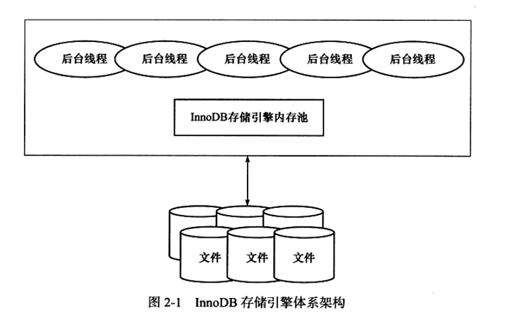

# MySQL体系结构和存储引擎

# InnoDB存储引擎
## InnoDB体系架构
简单的架构如下图所示



内存池主要负责维护所有进程/线程需要访问的内部数据结构，对磁盘上的进行缓存，重做日志缓存等。

后台线程负责刷新内存池中的数据，将已修改的数据文件刷新到磁盘文件，在发生异常时能恢复正常运行。

### 后台线程
后台线程有以下几种
* Master Thread：主要负责将缓冲池中的数据异步刷新到磁盘，保证数据的一致性，包括脏页的刷新、合并插入缓冲、UNDO也的回收。
* IO Thread：负责异步IO请求的回调处理。
* Purge Thread：事务提交后，对于的undolog不再需要。PurgeThread负责回收undo页。
* Page Cleaner Thread：用于将脏页刷新到磁盘。

### 内存
#### 缓冲池
缓冲池中包含了索引页、数据页、undo页、插入缓冲、自适应哈希索引、InnoDB存储的锁信息、数据字典信息等。

InnoDB允许多个缓冲池实例，每个页根据[哈希值](## "哈希值怎么计算？根据物理地址吗？")平均分配到不同缓冲池实例中。可以减少内部资源竞争，增加数据库的并发处理能力。

缓冲池通过LRU变种算法进行管理，它有以下特征
* 将列表分为两部分，前面的5/8是新列表，后面的3/8是旧列表，新列表尾部和旧列表头部的交界处称为重点。
* 新读取的页面添加到中点（旧列表的头部）
* 当访问旧列表中的页面时，会将它加到子列表的头部。

使用这种改进算法的原因是，当执行表扫描的时候会将大量页面带入缓冲池，提前读也会将一些页面带入缓冲区，这些页面进入缓冲区的时候会驱逐相同数量的页面，但是这些页面将不会再被使用，从而将降低了性能。

通过参数innodb_old_blocks_time可以配置当页被放置到中点后等待多久才会被加入到LRU列表的新列表。

page made young操作：页面从LRU列表的旧列表加入到新列表的操作。
page not made young操作：当因innodb_old_blocks_time设置而没有将页面从旧列表到新列表的操作。

通过命令``SHOW ENGINE INNODB STATUS``的BUFFER POOL AND MEMROY部分可以查看缓冲池的运行指标，如下图所示


通常情况下缓冲区命中率应该超过95%，否则说明存在LRU列表被污染的问题。

``SHOW ENGINE INNODB STATUS``命令显示的过去某个时间范围内的状态，具体信息INNODB_MONITOR_OUTPUT部分开头显示。


INNODB支持压缩页，即将16KB的页压缩为1KB、2KB、4KB和8KB。对于非16KB的页，通过unzip_LRU列表管理。

unzip_LRU列表对不同的大小的页进行分别管理，通过[伙伴算法]()进行内存的分配。

当LRU中的页被修改后，不会立即写回磁盘，而是通过检查点机制将脏页刷新会磁盘。使用Flush列表对脏页进行管理，脏页同时存在于LRU列表和Flush列表。``SHOW ENGINE INNODB STATUS``中的Modified db pages显示了脏页的数量。

[NEW]: # (ChangeBuffer, AdaptiveHashIndex,LogBuffer)

[OLD]: # (BEGIN)
#### 重做日志缓冲
INNODB将重做日志信息放入这个缓冲区，然后按一定的频率刷新到重做日志文件。默认大小为8MB，可以使用innodb_log_buffer_size控制。

重做日志刷新的情况
* Master Thread每秒将重做日志缓冲刷新到重做日志文件。
* 每个事务提交时会将重做日志缓冲刷新到重做日志文件。
* 当重做日志缓冲池剩余空间小于一半时，将其刷新到重做日志文件。

#### 额外的内存池
当对一些数据结构本身的内存进行分配时，需要从额外的内存池中进行申请，当该区域内存不够时，会从缓冲区中申请。
每个缓冲池的帧缓冲、缓冲控制对象（包含了LRU、锁、等待等信息）需要从额外内存池中申请，在提高缓冲池大小时，也应该相应提高额外的内存池大小。
[OLD]: # (END)

## 检查点技术
检查点技术解决以下几个问题
* 缩短数据库的恢复时间。
* 当缓冲池不够用时，将脏页刷新到磁盘。
* 当重做日志不可用时，刷新脏页。

InnoDB引擎通过LSN来标记版本，LSN是一个不断增长的8字节的数字。每个重做日志与一个开始LSN和结束LSN关联。当执行检查点时，InnoDB会在包含检查点LSN的文件的头部存储检查点的LSN。

每个页有LSN，重做日志中有LSN，Checkpoint有LSN。

重做日志是循环使用的

InnoDB存储引擎有两种检查点
* Sharp检查点：在数据库关闭时将所有脏页刷新会磁盘。
* Fuzzy检查点：只刷新一部分脏页。

Fuzzy检查点有以下几种
* Master Thread检查点：每秒或每十秒的速度从缓冲池中的脏页列表中刷新一定比例的页面会磁盘。异步刷新，不会阻塞用户查询。
* FLUSH_LRU_LIST检查点：当LRU中的页面被驱逐时执行。
* Async/Sync Flush检查点：当重做日志文件不可用时，强制将一些页刷新回磁盘。脏页从脏页列表中选取。

    定义已写入重做日志的LSN和刷新会磁盘的LSN之间的差值为checkpoint_age。
    定义async_water_mark为重做日志文件总大小的75%，sync_water_mark为重做日志文件总大小的90%。
    那么，刷新规则为
    
    * 当checkpoint_age $<$ async_water_mark时，不需要刷新脏页
    * 当async_water_mark $<$ checkpoing_age $<$ sync_water_mark时，触发Aysnc Flush，从Flush列表中刷新足够的脏页使得checkpoint_age $<$ async_water_mark。
    * 当checkpoint_age $>$ sync_water_mark时，触发SyncFlush，从Flush列表中刷新足够的脏页使得checkpoint_age $<$ async_water_mark。一般很少发生，除非重做日志文件很小且进行阻塞插入操作。
* Dirty Page too much检查点：当脏页的数量过多时，会强制进行检查点。使用参数innodb_max_dirty_pages_pct控制，表示缓冲池中脏页比例超过该参数的值时，强制执行检查点。

## Master Thread工作方式
Master Thread具有最高的线程优先级别，内部由多个循环组成，会根据数据库的运行状态在循环之间进行切换，多个循环分别如下所示
* 主循环：大多数操作在这个循环中进行，其中有两个主要的操作：每秒钟的操作和每十秒的操作。

    每秒一次的操作包括
    * 日志缓冲刷新的磁盘，即使事务没有提交（必定）：可让较大事务提交时间也很短。
    * 合并插入缓冲（可能）：判断前一秒内发生的IO次数是否小于5次，如果小于5次，则认为IO压力小，可以执行合并插入缓冲操作。
    * 至多刷新100个缓冲池钟的脏页到磁盘（可能）：判断当前缓冲池中脏页的比例（buf_get_modified_ratio_pct）是否超过了innodb_max_dirty_pages_pct。
    * 如果当前没有用户活动，则切换到后台循环（可能）。

    每十秒的操作包括：
    * 刷新100个脏页到磁盘（可能）：过去10秒内磁盘IO操作是否小于200次。
    * 合并至多5个插入缓冲（必定）
    * 将日志缓冲刷新到磁盘（必定）
    * 删除无用的Undo页（必定）：删除MVCC中不需要的行，即结束事务id小于当前最小事务id的数据。最多尝试回收20个undo页。
    * 刷新100个或者10个脏页到磁盘（必定）：缓冲池中脏页的比例（buf_get_modified_ratio_pct）超过70%，刷新100个脏页；否则刷新10%的脏页。


* 后台循环：若数据库空闲或数据库关闭时，会切换到后台循环，执行以下操作
    * 删除无用的undo页（必定）
    * 合并20个插入缓冲（必定）
    * 跳回主循环或刷新循环：当空闲时，跳转到刷新循环，否则跳转到主循环。

* 刷新循环：在刷新循环中，每次刷新100个脏页到磁盘中，直到缓冲区中的脏页比例小于innodb_max_dirty_pages_pct变量值。如果没有其他事情可做，就会跳转到暂停循环中。

* 暂停循环：在暂停循环中，会将Master Thread线程挂起，等待事件的发生。事件发生后跳转到主循环中。


综上所述，Master Thread的伪代码为
``` c
void master_thread() {
    goto loop;
    loop:
    for (int i = 0; i < 10; i++) {
        thread_sleep(1);
        do log buffer flush to disk;
        if (last_one_second_ios < 5) {
            do merge at most 5 insert buffer;
        }
        if (buf_get_modified_ratio_pct > innodb_max_dirty_pages_pct) {
            do buffer pool flush 100 dirty page;
        }
        if (no user activity) {
            goto background loop;
        }
    }
    if (last_ten_second_ios < 200) {
        do buffer pool flush 100 dirty page;
    }
    do merge at most 5 insert buffer;
    do log buffer flush to disk;
    do full purge;
    if (buf_get_modified-ratio_pct > 70%) {
        do buffer pool flush 100 dirty page;
    } else {
        buffer pool flush 10 dirty page;
    }
    goto loop;
    background loop:
    do full purge;
    do merge 20 insert buffer;
    if not idle:
        goto loop;
    else
        goto flush loop;
    flush loop:
    do buffer pool flush 100 dirty page;
    if (buf_get_modified_ratio_pct > innodb_max_dirty_pages_pct) {
        goto flush loop;
    }
    goto suspend loop;
    suspend loop:
    suspend_thread();
    waiting event;
    goto loop;
}
```

# 文件

# 表

# 索引与算法

# 锁

# 事务

# 备份与恢复

# 性能调优

# InnoDB存储引擎源代码的编译和调试